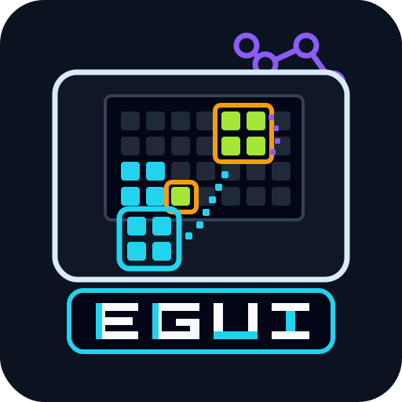
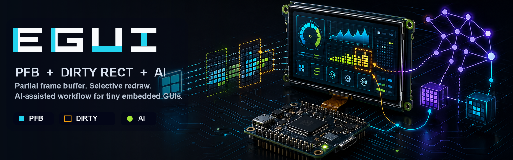
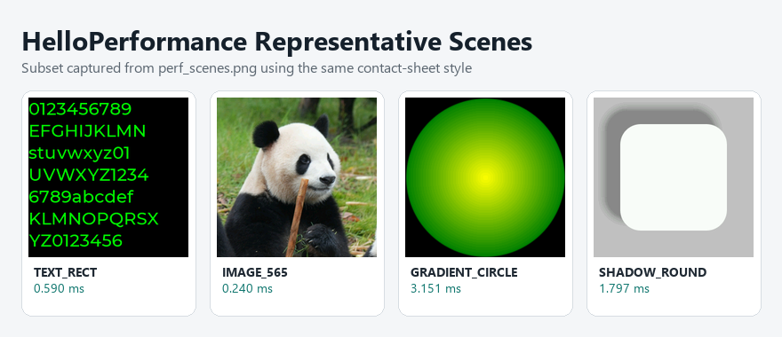

<p align="center">
  
</p>

# EmbeddedGUI

[](https://github.com/EmbeddedGUI/EmbeddedGUI/actions/workflows/github-actions-demo.yml) [](https://embeddedgui.readthedocs.io/en/latest/?badge=latest)

> **面向资源受限嵌入式系统的轻量级 C GUI 框架**
> RAM < 8 KB · ROM < 64 KB · CPU ~100 MHz · 无 FPU · 纯 C99 · MIT 许可

**[在线体验](https://embeddedgui.github.io/EmbeddedGUI/) · [完整文档](https://embeddedgui.readthedocs.io/en/latest/) · [Gitee](https://gitee.com/embeddedgui/EmbeddedGUI) · [GitHub](https://github.com/EmbeddedGUI/EmbeddedGUI)**



EmbeddedGUI 把嵌入式 GUI 的低资源约束、PFB 局部帧缓冲、脏矩形渲染和自动化验证流程放在同一个工程体系里；配合 AI 辅助开发，可以更快完成控件设计、资源生成、性能分析和跨平台验证。

**一眼看懂：**

- **做什么**：给资源受限 MCU 提供可用、可控、可验证的 GUI 方案
- **怎么做**：PFB + 脏矩形 + 纯 C99 + 定点数
- **适合谁**：需要低 RAM / 低 ROM、又想保留较完整控件能力的嵌入式项目
- **怎么上手**：先看快速入门，再跑 `HelloSimple`，然后进入 `HelloBasic`

- **程序员友好**：纯 C99、结构体 OOP、宏辅助类型转换，核心路径清晰可读
- **AI 协作友好**：文档化 workflow、可复现构建、QEMU 微秒级基准，适合让 AI 参与设计、排错和回归检查
- **嵌入式友好**：无 FPU、低 RAM/ROM、PC/STM32/QEMU/WASM 多平台覆盖，支持多屏与异构屏配置

## 🧭 新手建议先看

- 先看 [快速入门](doc/source/getting_started/index.rst)
- 再看 [项目总索引](doc/source/appendix/project_index.md)
- 然后按需进入 [架构原理](doc/source/architecture/index.rst)、[控件参考](doc/source/widgets/index.rst)、[应用开发](doc/source/app/index.rst)

如果你只想先跑起来，直接执行 `HelloSimple`；如果你想按能力逐步深入，建议先看 `HelloBasic`，再看 `HelloActivity` 和 `HelloVirtual`。

---

## 📸 效果预览

HelloShowcase，所有控件的简单示例。


HelloStyleDemo，一个常规的多页面应用。


---

## ✨ 超轻量 PFB 架构

不需要全屏帧缓冲，30×40 像素的小块缓冲（RGB565 仅 **2.4 KB**）即可驱动整个屏幕。

**HelloSimple 资源占用**：

| Code | Resource | RAM | PFB | Total ROM |
|------|----------|-----|-----|-----------|
| 20,780 B (~20 KB) | 8,016 B (~8 KB) | 968 B | 2,400 B | 28,796 B |

- **脏矩形**：只重绘变化区域，静态画面零 CPU 消耗，降低功耗
- **纯 C99**：无第三方依赖，支持 C++ 调用，易于移植
- **抗锯齿**：圆 / 弧 / 线全部支持 4×4 子像素抗锯齿，可降级为快速查表模式

---

## 🔄 Virtual 控件 —— 按需实例化，省 RAM

传统方式 100 个列表项 = 100 个控件实例；Virtual 模式**只实例化屏幕可见项**，其余回收复用。

| | 传统模式 | Virtual 模式 |
|---|---|---|
| 100 项列表 | 100 个实例 | 仅可见项实例化 |
| 内存策略 | 全部常驻 | 可见区 + overscan 缓冲 |

**底层组件**（`src/widget/egui_view_virtual_*.h`）：Viewport · Page · Grid · Strip · Section List · Tree · Stage

**高级封装**（ViewHolder 模式）：ListView · GridView

> 示例：[example/HelloVirtual](example/HelloVirtual)（19 个子应用）

---

## 🖥️ 多屏与异构屏

核心运行时支持 `EGUI_CONFIG_MAX_DISPLAY_COUNT` 配置多个 display/core，PC SDL 端可同时打开多窗口，并按 display 维度隔离输入、截图和录制帧。

| 示例 | 说明 |
|------|------|
| `HelloMultiDisplay` | 双屏 Activity 示例，验证主副屏点击隔离、并发 Activity 动画和 core task queue |
| `HelloMultiDisplayHetero` | 主屏 + 小尺寸副屏的异构屏示例，验证副屏 tick 连续性、跨 core 同步和副屏点击复位 |

异构屏可通过 `EGUI_CONFIG_SCREEN_1_WIDTH` / `EGUI_CONFIG_SCREEN_1_HEIGHT` / `EGUI_CONFIG_PFB_1_WIDTH` / `EGUI_CONFIG_PFB_1_HEIGHT` 为额外 display 配置独立尺寸。

---

## ✏️ 4 种遮罩，像素级视觉效果

| 遮罩 | 用途 |
|------|------|
| `mask_circle` | 圆形剪切 |
| `mask_round_rectangle` | 圆角矩形剪切 |
| `mask_gradient` | Alpha 渐变遮罩 |
| `mask_image` | 图片 Alpha 遮罩 |

支持**行级批处理优化**，非逐像素暴力遍历，在保证效果的同时兼顾性能。

---

## 📊 QEMU 微秒级性能基准 —— 每次提交都可量化

基于 QEMU 指令级模拟（`-icount shift=0`），同一代码在任何机器上得到**相同结果**，回归检测阈值 10%。

<p align="center">
  
</p>

**关键数据**（Cortex-M3 profile）：

| 场景 | 耗时 |
|------|------|
| TEXT_RECT | 0.590 ms |
| IMAGE_565 | 0.240 ms |
| GRADIENT_CIRCLE | 3.151 ms |
| SHADOW_ROUND | 1.797 ms |

覆盖 **200+ 个测试场景**，涵盖图形 / 文本 / 图片 / 遮罩 / 动画，支持 PFB Matrix / SPI Matrix 矩阵测试。

---

## 📱 三种页面方案，按需选择

| | Activity | Page | Virtual Stage |
|---|---|---|---|
| 复杂度 | 完整生命周期（6 状态） | 轻量（open/close） | 控件级容器 |
| 内存 | 栈式管理，常驻 | union 可重用 RAM | 回收池复用 |
| 适用场景 | 导航栈、完整 App | 简单多页切换 | 仪表盘、叠层布局 |

- **Activity**：类 Android 生命周期（CREATE → RESUME → PAUSE → DESTROY），配套 Dialog（浮层对话框）和 Toast（通知气泡）
- **Page**：精简模式，RAM 通过 union 重用，有基本输入事件分发
- **Virtual Stage**：绝对定位 + Z 轴排序，支持 pin/unpin 和 hit testing

> 小项目用 Page 省到极致，复杂项目用 Activity 完整管控，高级场景用 Virtual Stage 动态编排。

---

## 🚀 快速开始

```bash
git clone https://gitee.com/embeddedgui/EmbeddedGUI.git
cd EmbeddedGUI
# Windows
setup.bat
# Linux / macOS
./setup.sh
make all APP=HelloStyleDemo && make run
```

> 安装脚本默认会创建 `.venv` 并安装当前仓库所需的 Python 依赖。
> 更多说明见[环境搭建文档](https://embeddedgui.readthedocs.io/en/latest/)。

### 平台支持

| 平台 | 说明 |
|------|------|
| **PC (SDL2)** | 桌面模拟器，截图输出，快速开发验证 |
| **PC Test** | 无 SDL 的 headless 测试端口，用于 `HelloUnitTest` 和 CI |
| **STM32G0** | ARM Cortex-M0+ 裸机移植 |
| **QEMU** | 微秒级计时器，用于性能基准测试 |
| **WebAssembly** | Emscripten 编译，在线 Demo 直接运行 |
| **Designer Port** | 无 SDL、基于 stdin/stdout IPC 的设计器预览端口 |
| **自定义移植** | 仅需实现 `draw_area` + `get_tick_ms` 两个接口 |

构建系统：**GNU Make** 覆盖全部端口；**CMake** 当前覆盖带 `CMakeLists.txt` 的示例和 `pc` / `pc_test` 端口。

---

## ❓ 常见问题

### 这个项目最适合什么场景？

适合资源受限的嵌入式 GUI 场景，尤其是需要低 RAM / 低 ROM、局部刷新和可控移植成本的项目。

### 如果我刚开始接触，应该怎么上手？

建议先看快速入门，再跑 `HelloSimple`，然后按需进入 `HelloBasic`、`HelloActivity`、`HelloVirtual`。

### 这个项目和大框架相比优势是什么？

优势主要在于资源占用更低、架构更明确、适合 MCU 场景，并且有配套的性能/体积分析与自动化验证。

### 有没有推荐的验证方式？

有，建议在修改后执行构建和运行时验证，再结合性能和体积分析判断改动是否合适。

### 我应该优先看哪些文档？

先看 `doc/source/getting_started/index.rst`，再看 `doc/source/appendix/project_index.md`，之后按需要进入架构、控件和应用开发章节。

## 🧩 HelloBasic 控件库（66 个）

**布局**：Group · LinearLayout · GridLayout · Scroll · ViewPage · ViewPageCache · TileView · Window · Card

**显示**：Label · DynamicLabel · Image · DeferredImage · FileImage · Divider · Line · Textblock · Spangroup · LyricScroller

**输入**：Button · ImageButton · ButtonMatrix · Switch · Checkbox · RadioButton · ToggleButton · Slider · ArcSlider · NumberPicker · Roller · Combobox · Spinner · TextInput · Menu · AutoComplete · Chips · SegmentedControl · Stepper · PatternLock

**进度**：ProgressBar · CircularProgressBar · ActivityRing · PageIndicator · TabBar · Led · NotificationBadge · Scale · Gauge

**图表**：ChartLine · ChartScatter · ChartBar · ChartPie

**时间**：AnalogClock · DigitalClock · Stopwatch · MiniCalendar · Compass · HeartRate · AnimatedImage · Mp4

**列表**：List · Table

**专项验证**：Dirty Passthrough Container / Page / Activity · PunchRegion · SVG

---

## 🎨 绘图图元

| 类别 | 能力 |
|------|------|
| 基础图形 | 点、线、矩形、圆角矩形（可独立圆角）、三角形 |
| 圆 / 弧 | 查表模式（快速）+ 4×4 子像素 HQ 抗锯齿模式，支持圆头弧帽 |
| 线段 | 距离场 AA + 4×4 HQ 子像素，支持圆头线帽 |
| 折线 | 普通 / HQ / 圆头折线 |
| 曲线 | 二次 / 三次贝塞尔曲线（可选编译） |
| 椭圆 | 填充 / 描边椭圆（可选编译） |
| 多边形 | 填充 / 描边多边形（可选编译） |
| 渐变填充 | 线性（垂直 / 水平）+ 径向渐变，多停止点，可选抖动 |
| 文本 | 区域内绘制 / 多行 / 对齐，UTF-8 支持 |
| 图片 | 原尺寸 / 缩放绘制，支持染色 |

---

## 🎬 动画系统

**6 种动画类型**：Alpha（淡入淡出）· Translate（平移）· Scale/Size（缩放）· Resize（尺寸过渡）· Color（颜色插值）· AnimationSet（组合动画）

**9 种插值器**：

| 插值器 | 效果 |
|--------|------|
| Linear | 匀速 |
| Accelerate | 先慢后快 |
| Decelerate | 先快后慢 |
| AccelerateDecelerate | 缓入缓出 |
| Anticipate | 先回退再前进 |
| Overshoot | 超出目标后回弹 |
| AnticipateOvershoot | 回退 + 超出回弹 |
| Bounce | 末端弹跳 |
| Cycle | 正弦循环 |

支持：循环次数、RESTART / REVERSE 模式、fill_before / fill_after、start / repeat / end 回调。

---

## ⚙️ 可配置功能开关

所有功能均可在 `app_egui_config.h` 中按需裁剪，零开销禁用。

### 输入系统

| 宏 | 默认 | 说明 |
|----|------|------|
| `EGUI_CONFIG_FUNCTION_SUPPORT_TOUCH` | 1 | 单点触控 |
| `EGUI_CONFIG_FUNCTION_SUPPORT_MULTI_TOUCH` | 0 | 多点触控（双指 + 滚轮） |
| `EGUI_CONFIG_FUNCTION_SUPPORT_KEY` | 0 | 硬件按键事件 |
| `EGUI_CONFIG_FUNCTION_SUPPORT_FOCUS` | 0 | 键盘焦点导航（依赖 KEY） |

### UI 特效

| 宏 | 默认 | 说明 |
|----|------|------|
| `EGUI_CONFIG_FUNCTION_SUPPORT_SHADOW` | 0 | 阴影渲染 |
| `EGUI_CONFIG_FUNCTION_SUPPORT_LAYER` | 0 | Z 轴图层系统 |
| `EGUI_CONFIG_FUNCTION_SUPPORT_SCROLLBAR` | 1 | 自动滚动条指示器 |
| `EGUI_CONFIG_FUNCTION_SUPPORT_DIRTY_PASSTHROUGH` | 0 | 容器透传脏区，用于减少复合控件刷新面积 |
| `EGUI_CONFIG_FUNCTION_WIDGET_ENHANCED_DRAW` | 0 | 增强渲染（渐变 + 阴影，自动开启两者） |
| `EGUI_CONFIG_FUNCTION_GRADIENT_DITHERING` | 0 | 渐变抖动（消除 16 位色带） |

### 抗锯齿质量

| 宏 | 默认 | 说明 |
|----|------|------|
| `EGUI_CONFIG_CIRCLE_HQ_SAMPLE_2X2` | 0 | 2×2 快速采样（0 = 4×4 高质量） |
| `EGUI_CONFIG_LINE_HQ_SAMPLE_2X2` | 0 | 同上，用于线段 |

### 性能 / 内存

| 宏 | 默认 | 说明 |
|----|------|------|
| `EGUI_CONFIG_PFB_BUFFER_COUNT` | 2 | PFB 缓冲数（≥2 支持 DMA 流水线） |
| `EGUI_CONFIG_MAX_DISPLAY_COUNT` | 1 | display/core 数量，多屏示例设为 2 |
| `EGUI_CONFIG_MAX_FPS` | 60 | 帧率上限 |
| `EGUI_CONFIG_DIRTY_AREA_COUNT` | 5 | 脏矩形区域槽位数 |
| `EGUI_CONFIG_PERFORMANCE_USE_FLOAT` | 0 | 有 FPU 时启用浮点加速 |
| `EGUI_CONFIG_COLOR_16_SWAP` | 0 | RGB565 字节交换，作为默认 runtime 值 |
| `EGUI_CONFIG_FUNCTION_SOFTWARE_ROTATION_ENABLE` | 0 | 软件旋转编译裁剪开关，同时也是默认 runtime 值 |

多屏或异构屏场景下，`EGUI_CONFIG_COLOR_16_SWAP` 更推荐通过 `egui_display_setup_t.render_config` 按 core 覆盖；
软件旋转则建议通过 `egui_display_setup_t.render_config->software_rotation` 逐 core 覆盖；`EGUI_CONFIG_PFB_BUFFER_COUNT` 当前有效范围为 `1..4`。

### 资源 / 图片

| 宏 | 默认 | 说明 |
|----|------|------|
| `EGUI_CONFIG_FUNCTION_EXTERNAL_RESOURCE` | 0 | 启用外部资源读取，自动启用资源管理器 |
| `EGUI_CONFIG_FUNCTION_RESOURCE_MANAGER` | 0 | 资源管理器 |
| `EGUI_CONFIG_FUNCTION_IMAGE_CODEC_QOI` | 0 | QOI 图片解码 |
| `EGUI_CONFIG_FUNCTION_IMAGE_CODEC_RLE` | 0 | RLE 图片解码 |
| `EGUI_CONFIG_FUNCTION_IMAGE_RUNTIME_SVG` | 0 | 运行时 SVG 渲染，需要 RGB565 和 RGB565_8 图片格式支持 |

### 主题系统

通过 `EGUI_THEME_*` 宏统一管理全局视觉风格，所有控件从同一套设计令牌取色。

| 令牌 | 默认值 | 语义 |
|------|--------|------|
| `EGUI_THEME_PRIMARY` | `#2563EB` | 主题蓝（按钮 / 选中） |
| `EGUI_THEME_SECONDARY` | `#14B8A6` | 次要色（Teal） |
| `EGUI_THEME_SUCCESS` | `#16A34A` | 成功（绿） |
| `EGUI_THEME_WARNING` | `#F59E0B` | 警告（琥珀） |
| `EGUI_THEME_DANGER` | `#DC2626` | 危险（红） |
| `EGUI_THEME_SURFACE` | `#FFFFFF` | 控件背景 |
| `EGUI_THEME_TEXT_PRIMARY` | `#111827` | 正文颜色 |
| `EGUI_THEME_TEXT_SECONDARY` | `#6B7280` | 辅助文字颜色 |
| `EGUI_THEME_FOCUS` | PRIMARY | 焦点环颜色 |
| `EGUI_THEME_RADIUS_MD` | 10 px | 中等圆角半径 |

---

## 🛠️ UI Designer

UI Designer 桌面端和设计稿转换链路已经迁移到独立仓库 `EmbeddedGUI_Designer` 维护。

```
Figma / HTML / JSX ──→ XML ──→ C 源文件 (`uicode_disp0.c` / `uicode_disp0.h`)
```

- **当前仓库定位**：保留 SDK、运行时、资源生成、示例、文档，以及供 Designer 调用的 headless 预览端口
- **Designer 仓库定位**：维护桌面设计器、设计稿导入、XML 编辑和预览打包
- **Designer 入口**：见 `doc/source/ui_designer/index.rst`


### 字体 / 图像

**字体**：资源字体（`egui_font_std`），内置 Montserrat，UTF-8 解码，支持多行对齐。

**图像格式**：RGB32（ARGB8888）、RGB565、RGB565 调色板（1/2/4/8 bit）、Alpha 遮罩（1/2/4/8 bit），全部可按需关闭以节省 ROM。

---

## 🔧 工具链

| 工具 | 命令 | 说明 |
|------|------|------|
| 构建 | `make all APP=<APP>` | 编译指定示例 |
| 运行 | `make run` | 启动 PC 模拟器 |
| 资源生成 | `make resource_refresh APP=<APP>` | 生成字体 / 图片 C 文件 |
| 运行时验证 | `python scripts/code_runtime_check.py --app <APP> [--app-sub <SUB>]` | 截图验证渲染正确性 |
| 体积分析 | `python scripts/size_analysis/main.py --case-set typical` | 生成 qemu 口径 ROM/RAM/heap/stack 报告 |
| 性能分析 | `python scripts/perf_analysis/main.py --profile cortex-m3` | 生成 QEMU 微秒级性能报告 |
| CI 编译检查 | `python scripts/code_compile_check.py --full-check` | 全量编译检查 |
| 发布前检查 | `python scripts/release_check.py --scope multi-display` | 多屏编译、运行、文档专项回归 |

---

## 📦 资源占用

以下为 `doc/source/size/size_report.md` 中的 QEMU 口径快照：`PORT=qemu CPU_ARCH=cortex-m0plus`，静态体积只统计仓库侧 `src/` + `example/` 对象，运行期 heap/stack 由 QEMU 录制动作测得。

| App | Code | Resource | RAM | PFB | Heap Peak | Stack Peak | Total ROM |
|-----|------|----------|-----|-----|-----------|------------|-----------|
| HelloSimple | 15340 | 2506 | 169 | 2400 | 0 | 820 | 17846 |
| HelloBasic(button) | 26284 | 18289 | 521 | 4800 | 276 | 1168 | 44573 |
| HelloBasic(label) | 21548 | 6341 | 380 | 4800 | 276 | 1096 | 27889 |
| HelloBasic(list) | 30504 | 15742 | 1734 | 4800 | 276 | 1312 | 46246 |
| HelloBasic(mask) | 84732 | 43714 | 564 | 4800 | 320 | 4080 | 128446 |
| HelloBasic(textinput) | 40828 | 16004 | 3722 | 4800 | 276 | 1200 | 56832 |
| HelloBasic(svg) | 35320 | 9502 | 749 | 2400 | 29266 | 2832 | 44822 |
| HelloPerformance | 270924 | 1834759 | 3017 | 1536 | 5336 | 432 | 2105683 |
| HelloShowcase | 166648 | 70159 | 14608 | 40960 | 276 | 2440 | 236807 |
| HelloStyleDemo | 127904 | 102545 | 5906 | 19200 | 276 | 2640 | 230449 |
| HelloVirtual(virtual_stage_showcase) | 190044 | 72303 | 8127 | 40960 | 3256 | 2672 | 262347 |

> 运行 `python scripts/size_analysis/main.py --case-set typical` 生成最新报告；再运行 `python scripts/size_analysis/main.py size-to-doc` 刷新 `doc/source/size/` 文档。

---

## 📚 推荐学习路径

如果你是第一次接触这个项目，建议按下面顺序开始：

1. `example/HelloSimple`：先确认环境和渲染链路正常
2. `example/HelloBasic/button` 或 `example/HelloBasic/label`：理解最基础的控件写法
3. `example/HelloBasic/scroll` 或 `example/HelloBasic/viewpage`：理解布局、滚动和页面切换
4. `example/HelloActivity`：理解类 Android 的页面生命周期
5. `example/HelloVirtual`：理解按需实例化的 Virtual 控件体系
6. `example/HelloPerformance` 与 `example/HelloSizeAnalysis`：理解性能与体积分析方法

如果你只想最快看到结果，直接先跑 `HelloSimple`；如果你想按能力逐步深入，建议接着看 `HelloBasic`、`HelloActivity`、`HelloVirtual`。

## 📚 示例应用（23 个）

| 示例 | 说明 |
|------|------|
| `HelloSimple` | 最小 Hello World |
| `HelloActivity` | Activity 生命周期演示 |
| `HelloAPP` | 完整多页面应用 |
| `HelloBasic` | **66 个独立控件 / 专项验证演示** |
| `HelloVirtual` | **19 个 Virtual 控件示例** |
| `HelloCanvas` | 绘图图元展示 |
| `HelloChart` | 图表控件演示 |
| `HelloDirty` | 脏区刷新局部重绘演示 |
| `HelloGradient` | 渐变填充效果 |
| `HelloLayer` | Z 轴图层演示 |
| `HelloMultiDisplay` | 双屏 Activity 与多 core 录制验证 |
| `HelloMultiDisplayHetero` | 主副异构屏与跨 core 同步验证 |
| `HelloStyleDemo` | 主题 / 增强样式演示 |
| `HelloPerformance` | FPS / 性能基准 |
| `HelloPFB` | PFB 渲染演示 |
| `HelloResourceManager` | 外部资源管理器 |
| `HelloEasyPage` | EasyPage API 演示 |
| `HelloShowcase` | UI 全景展示 |
| `HelloSizeAnalysis` | 体积分析 probe 和配置模板 |
| `HelloSVGSpec` | SVG 运行时渲染规范对比基座 |
| `HelloTest` | PC 调试与动态渲染测试场景 |
| `HelloUnitTest` | 单元测试 |
| `HelloViewPageAndScroll` | 翻页 + 滚动演示 |

---

## 📝 写在最后

作为芯片从业人员，国产芯片资源有限（512 KB ROM、20 KB RAM、96 MHz CPU），需要跑手环级别的触控 GUI。评估了 [GuiLite](https://github.com/idea4good/GuiLite)（无 PFB）、[Arm-2D](https://github.com/ARM-software/Arm-2D)（无控件管理）、[LVGL](https://github.com/lvgl/lvgl)（资源需求太高），各有优势但都不完全满足需求，最终决定自己写一套——什么都可控，极限优化。

现在有 AI 加持，渐变、KEY 输入、Focus 系统、Layer、UI Designer 等功能不断加入，框架越来越好用，也更方便维护。

EmbeddedGUI 最初是为资源极紧张的芯片场景做的，现在已经逐步长成一套更完整的嵌入式 GUI 工程体系：既要能跑得起来，也要能测、能看、能分析、能迁移。

如果你是第一次使用这个项目，建议按下面顺序开始：

1. 先看 [快速入门](doc/source/getting_started/index.rst)
2. 再看 [项目总索引](doc/source/appendix/project_index.md)
3. 然后跑 `HelloSimple`
4. 接着看 `HelloBasic` 和 `HelloActivity`
5. 最后按需求进入性能、体积、移植和应用开发章节

如果你想更快定位内容，就直接从下面的文档导航进入。

---

## 🧭 文档导航

- [快速入门](doc/source/getting_started/index.rst)
- [架构原理](doc/source/architecture/index.rst)
- [控件参考](doc/source/widgets/index.rst)
- [动画系统](doc/source/animation/index.rst)
- [资源管理](doc/source/resource/index.rst)
- [性能测试](doc/source/performance/index.rst)
- [体积分析](doc/source/size/index.rst)
- [移植指南](doc/source/porting/index.rst)
- [调试与验证](doc/source/debug/index.rst)
- [应用开发](doc/source/app/index.rst)
- [UI Designer](doc/source/ui_designer/index.rst)
- [附录与索引](doc/source/appendix/index.rst)

## 🔗 相关链接

- 在线体验：https://embeddedgui.github.io/EmbeddedGUI/
- 文档：https://embeddedgui.readthedocs.io/en/latest/
- Gitee：https://gitee.com/embeddedgui/EmbeddedGUI
- GitHub：https://github.com/EmbeddedGUI/EmbeddedGUI

---

## 💬 社区

欢迎大家入群交流讨论。

<table>
  <tr>
    <td align="center"><br /><sub><b>QQ</b></sub></a>
  </tr>
</table>
