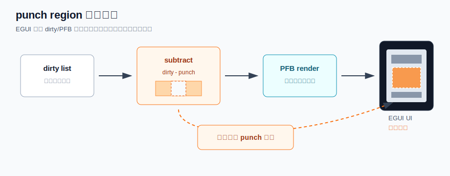
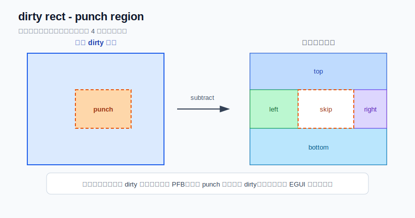
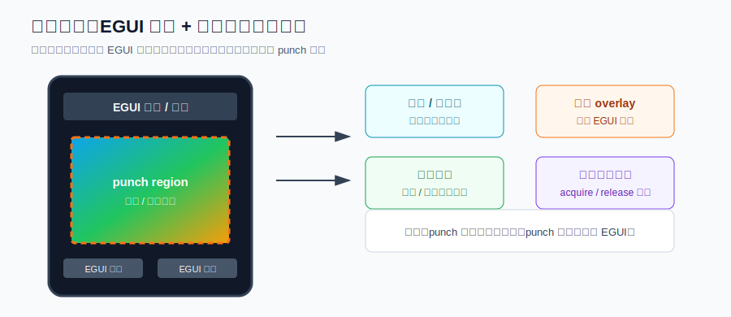

# Punch Region 设计原理与使用场景

## 作用概述

`punch region` 是一个由应用层拥有的屏幕矩形区域。设置后，EmbeddedGUI 在 dirty/PFB 刷新流程中会把这个矩形从待重绘区域里扣掉，剩余区域继续由 EGUI 的视图树渲染；被扣掉的区域不再由 EGUI 画布重绘，而是交给应用、解码器、硬件 overlay 或平台驱动直接写屏。

它解决的是这类问题：界面主体仍然需要 EGUI 管理布局、控件、文字和状态，但屏幕中有一块像素来自另一条渲染路径。例如视频预览、摄像头画面、外部文件解码后的渐进显示、硬件图层、DMA 直接刷屏区域等。



## 核心设计

EmbeddedGUI 的正常刷新路径是：

```text
view invalidate -> dirty list -> PFB tile render -> display flush
```

加入 `punch region` 后，dirty list 的产生方式不变，变化发生在每个 dirty 矩形真正进入 PFB 渲染之前：

```text
dirty rect
    -> egui_region_subtract_rect(dirty, core->punch_region, rects)
    -> 0..4 个剩余矩形
    -> 对剩余矩形继续执行 egui_core_draw_view_group()
```

也就是说，`punch region` 不是一种控件，也不是透明遮罩；它是核心刷新路径上的“排除区域”。EGUI 仍然知道整棵视图树如何绘制，但在提交 PFB tile 时主动避开应用声明的矩形。



当前实现中，一个 `egui_core_t` 维护一个 `punch_region`。`egui_core_set_punch_region()` 会记录新的屏幕坐标矩形；当旧区域非空且发生变化时，旧区域会被加入 dirty list，让 EGUI 有机会把旧位置恢复成正常 UI。

## 与 delayed image 的关系

它和 image file 的 delayed 处理很像，都是“UI 先建立，像素数据稍后到达”的场景：

| 机制 | 像素所有权 | 刷新路径 | 适合场景 |
| --- | --- | --- | --- |
| delayed image | EGUI 控件拥有最终像素 | 数据到达后通过控件 invalidate，再走 PFB 渲染 | 图片文件异步加载、解码后仍希望由 EGUI 合成 |
| punch region | 应用或平台拥有该矩形像素 | EGUI 跳过该矩形，应用直接写屏 | 视频、摄像头、硬件 overlay、行级渐进直绘 |

如果最终像素仍然需要参与 EGUI 的透明混合、裁剪、变换或控件层级，优先使用普通 image/delayed image 路径。如果这块区域应该完全绕开 EGUI，由外部管线直接刷新，就更适合使用 `punch region`。

## 典型使用场景



常见场景包括：

- 视频播放器：标题栏、按钮、进度条由 EGUI 绘制，中间视频窗口由解码器或硬件 overlay 刷新。
- 摄像头预览：EGUI 管理拍照按钮、状态文字、边框，摄像头帧缓冲直接显示在预览区域。
- 大图或文件解码：先显示 EGUI 外框和占位状态，文件解码器按行或按块把图像写入 punch 区域。
- 外部总线设备：LCD、Flash、相机共用总线时，应用在直绘前后通过总线锁与 PFB flush 避免冲突。
- 多媒体仪表盘：EGUI 刷新低频 UI，仪表图像或波形区域由专用渲染任务高频更新。

不适合使用的场景：

- 只是想在 EGUI 内部做透明洞、圆角裁剪或遮罩，应使用控件、canvas 或 mask 能力。
- punch 区域内部仍有 EGUI 控件需要显示，因为该区域会被 PFB 渲染路径跳过。
- 需要多个不相邻洞口。当前核心只维护一个矩形；多个区域需要先扩展 core 数据结构和 subtract 流程。

## 使用步骤

### 1. 规划稳定的屏幕矩形

`punch region` 使用屏幕坐标，不是控件局部坐标。建议把它设计成一个稳定矩形，让 EGUI 负责绘制周围标题、边框、状态栏等内容，把矩形内部完全交给应用直绘。

```c
#define PUNCH_REGION_X 24
#define PUNCH_REGION_Y 88
#define PUNCH_REGION_W 192
#define PUNCH_REGION_H 128

egui_core_set_punch_region(core,
                           PUNCH_REGION_X,
                           PUNCH_REGION_Y,
                           PUNCH_REGION_W,
                           PUNCH_REGION_H);
```

### 2. 在 punch 区域外绘制 EGUI 内容

普通控件照常创建和加入视图树，但不要把必须可见的 EGUI 控件放进 punch 区域内部。可以把边框放在区域外侧，例如示例里用 2px 的普通 view 画出边框，中心矩形交给应用直绘。

### 3. 应用直接刷新 punch 区域

应用可以使用平台自己的显示接口，也可以复用 `egui_api_draw_data()` 提交一块像素数据。若显示总线可能正被 PFB flush 使用，应在直绘前后加锁：

```c
egui_pfb_bus_acquire(core);

egui_api_draw_data(core,
                   PUNCH_REGION_X,
                   PUNCH_REGION_Y + row_y,
                   PUNCH_REGION_W,
                   1,
                   row_pixels);

egui_pfb_bus_release(core);
egui_api_refresh_display(core);
```

是否需要调用 `egui_api_refresh_display()` 取决于端口显示驱动。如果直绘接口本身已经立即提交到 LCD，可以按端口语义调整；如果端口需要显式刷新，就应在直绘批次完成后刷新。

### 4. 在外部直绘期间延后 EGUI 刷新

`egui_port_should_defer_refresh(egui_core_t *core)` 是一个 port/app 可覆盖的弱符号 hook。它只在 `egui_check_need_refresh(core)` 已经发现 pending dirty、但 EGUI 还没有开始 PFB 渲染前被调用：

```text
egui_core_refresh_screen()
    -> animation/layout pre-work
    -> egui_check_need_refresh(core)
    -> egui_port_should_defer_refresh(core)
    -> egui_polling_refresh_display(core)
```

返回非 0 时，本轮 EGUI 刷新直接跳过，dirty list 不会被清空；下一轮 refresh timer 或手动调用 `egui_core_refresh_screen()` 时会再次检查。因此它适合表达“现在有 dirty，但是这个时刻不应该让 EGUI 抢占显示刷新”的平台策略。

典型场景是 punch 区域正在由解码器、摄像头、DMA 或硬件 overlay 分块写屏，同时页面外围的状态文字、进度条等 EGUI 控件也发生了变化。此时可以短时间返回非 0，让 EGUI 的外围刷新等外部批次结束后再执行，避免同一帧里外部直绘和 PFB flush 交错争用显示控制器或形成视觉上的半更新状态。

示例代码结构如下：

```c
static uint8_t media_write_active;

int egui_port_should_defer_refresh(egui_core_t *core)
{
    return core == media_core && media_write_active;
}

static void media_write_rows(void)
{
    media_write_active = 1;
    egui_pfb_bus_acquire(media_core);
    /* draw external rows */
    egui_pfb_bus_release(media_core);

    media_write_active = 0;
    egui_core_refresh_screen(media_core);
}
```

这个 hook 和 `egui_pfb_bus_acquire()` 的职责不同：

- `egui_pfb_bus_acquire()` / `egui_pfb_bus_release()` 保护的是底层显示总线或 flush 队列，避免直绘和 PFB flush 同时占用硬件通道。
- `egui_port_should_defer_refresh()` 保护的是 EGUI 自身的刷新时机。它让 dirty 保持 pending，等外部条件恢复后再统一渲染。

使用时要保证 defer 条件会被释放，并在释放后触发一次刷新；否则 dirty 会一直留在队列里，相关 EGUI 控件看起来就不会更新。不要用这个 hook 做长期限帧或 idle 省电策略；没有 dirty 时 `egui_check_need_refresh()` 已经会让刷新路径自然空转。

### 5. 离开页面或切换区域时清理

页面退出、切换到不再需要直绘的界面，或 punch 区域移动时，应设置新的区域或清空区域：

```c
egui_core_set_punch_region(core, 0, 0, 0, 0);
```

清空时旧区域会被标记为 dirty，下一帧由 EGUI 正常重绘。设置新区域时，旧区域会恢复，但新区域不会自动填充；应用需要立即绘制占位图或首帧，避免显示旧像素。

## 示例

本仓库提供了 `HelloBasic/punch_region` 例程，展示了和 delayed image 类似的分阶段行为：

1. EGUI 先绘制页面标题、说明文字、边框和状态文字。
2. 调用 `egui_core_set_punch_region()` 把中心区域声明为应用自绘。
3. 定时器先直绘占位内容，再按行批量直绘最终图像。
4. 行级直绘期间，例程覆盖 `egui_port_should_defer_refresh()` 暂停 EGUI 外围状态文字刷新；最终图像完成后释放 defer 并触发一次 EGUI 刷新。
5. 状态文字仍由 EGUI 控件更新，但中心图像始终不被 PFB 覆盖。

运行验证命令：

```bash
make all APP=HelloBasic APP_SUB=punch_region PORT=pc
python scripts/code_runtime_check.py --app HelloBasic --app-sub punch_region --keep-screenshots
```

核心代码位置：

- `src/core/egui_core.h`：`egui_core_t::punch_region` 和 `egui_core_set_punch_region()` API。
- `src/core/egui_core.c`：dirty rect 进入 PFB 渲染前调用 subtract，并在 pending dirty 进入 PFB 前调用 `egui_port_should_defer_refresh()`。
- `src/core/egui_region.h`：`egui_region_subtract_rect()` 把一个 dirty 矩形减去 punch 矩形，最多输出 4 个矩形。
- `example/HelloBasic/punch_region/test.c`：完整使用例程。

## 使用注意事项

- 当前只有一个 punch 矩形，属于单个 `egui_core_t`。
- 坐标应使用屏幕坐标，并尽量保持在屏幕范围内。
- punch 区域内部的像素生命周期由应用负责，EGUI 不会替它清空、重绘或补帧。
- 区域内部不要放置需要由 EGUI 显示的控件；如果必须显示叠加 UI，应把叠加层放到 punch 区域外，或改用普通 EGUI 渲染路径。
- 直绘和 PFB flush 共用总线时，使用 `egui_pfb_bus_acquire()` / `egui_pfb_bus_release()` 做同步。
- 使用 `egui_port_should_defer_refresh()` 时必须保证条件会释放，并在释放后触发一次刷新，否则 pending dirty 会持续保留。
- 区域移动或尺寸变化时，旧区域会由 EGUI 恢复，新区域需要应用重新绘制。
- 调试 dirty/PFB 时，punch 区域也会被跳过，因此中心区域看不到 EGUI 的 dirty 高亮是符合预期的。
