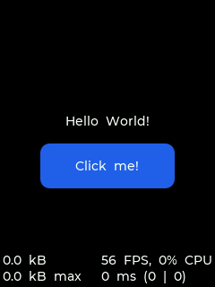
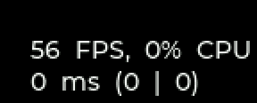
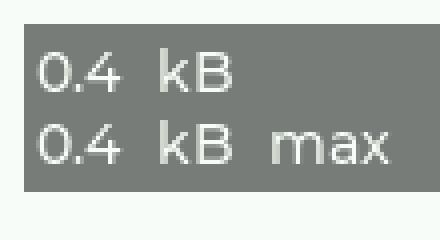

# Debug Monitor 行为说明

## 概述

`EGUI_CONFIG_DEBUG_INFO_SHOW` 已移除。

当前的屏幕调试监视信息拆成两个独立开关：

- `EGUI_CONFIG_DEBUG_PERF_MONITOR_SHOW`：显示 Performance Monitor
- `EGUI_CONFIG_DEBUG_MEM_MONITOR_SHOW`：显示 Memory Monitor

两者都采用 direct overlay 方式直接绘制到当前刷新路径里，不再依赖 `EGUI_CONFIG_CORE_SEPARATE_USER_ROOT_GROUP_ENABLE`，也不会额外创建调试控件树。

## 显示行为

当前实现位于 `src/core/egui_core.c` 的 debug overlay 逻辑附近，行为是：

1. `egui_core_refresh_screen()` 每次进入时，都会先更新 monitor 统计值。
2. 如果 monitor 文本发生变化，就把“上一次 overlay 区域”和“当前 overlay 区域”的并集重新标脏。
3. 真正进入绘制时，overlay 会像普通内容一样随当前 dirty region / PFB 一起绘制。
4. 绘制完成后，记录本次 overlay 实际区域，供下一次文本变化时做 union 标脏。

对应代码入口：

- monitor 更新：`egui_core_refresh_screen()`
- overlay 绘制：`egui_debug_draw_overlay_for_current_pfb()`
- overlay 标脏：`egui_debug_mark_overlay_dirty()`
- overlay 区域提交：`egui_debug_commit_overlay_region()`

这意味着：

- 自动刷新路径下，即使业务层没有新的 dirty，Performance Monitor 仍然会按 refresh timer 统计 FPS。
- 当 monitor 文本变化时，overlay 自己会触发一次局部刷新，因此空闲页最终会收敛到 `EGUI_CONFIG_MAX_FPS` 对应的显示值。
- Memory Monitor 没有单独的限频逻辑，只要页面进入刷新流程，就会读取当前 `current / peak`。

## 配置项

### 开关

```c
#define EGUI_CONFIG_DEBUG_PERF_MONITOR_SHOW 1
#define EGUI_CONFIG_DEBUG_MEM_MONITOR_SHOW  1
```

两个开关彼此独立，可以单独启用。

### 统计窗口

```c
#define EGUI_CONFIG_DEBUG_MONITOR_REFR_PERIOD 300U
```

当前代码里，这个宏实际用于 Performance Monitor 的统计窗口长度，单位是毫秒。

- 默认 `300 ms`
- `FPS`、`CPU`、`render avg`、`flush avg` 都基于这段窗口内的累计值计算
- Memory Monitor 不依赖这个窗口，它是每次刷新直接读取当前值

### 字体

```c
#define EGUI_CONFIG_DEBUG_MONITOR_FONT (&egui_res_font_montserrat_12_4)
```

当前两个 monitor 共用同一个字体宏。

- 默认字体是 `&egui_res_font_montserrat_12_4`
- 建议在 `app_egui_config.h` 或 `USER_CFLAGS` 里覆盖，不要直接改默认头文件
- 传入值应为 `egui_font_t` 兼容字体对象的地址
- 如果通过 `USER_CFLAGS` 覆盖，注意 Windows shell 下 `&` 需要做转义

例如：

```c
#define EGUI_CONFIG_DEBUG_MONITOR_FONT (&egui_res_font_montserrat_10_4)
```

或：

```c
#define EGUI_CONFIG_DEBUG_MONITOR_FONT (&egui_res_font_montserrat_14_4)
```

### 位置

Performance Monitor 和 Memory Monitor 各自有独立的位置参数：

```c
#define EGUI_CONFIG_DEBUG_PERF_MONITOR_POS       EGUI_ALIGN_BOTTOM_RIGHT
#define EGUI_CONFIG_DEBUG_PERF_MONITOR_OFFSET_X  0
#define EGUI_CONFIG_DEBUG_PERF_MONITOR_OFFSET_Y  0

#define EGUI_CONFIG_DEBUG_MEM_MONITOR_POS        EGUI_ALIGN_BOTTOM_LEFT
#define EGUI_CONFIG_DEBUG_MEM_MONITOR_OFFSET_X   0
#define EGUI_CONFIG_DEBUG_MEM_MONITOR_OFFSET_Y   0
```

可用对齐值与普通对齐宏一致，例如：

- `EGUI_ALIGN_TOP_LEFT`
- `EGUI_ALIGN_TOP_MID`
- `EGUI_ALIGN_TOP_RIGHT`
- `EGUI_ALIGN_BOTTOM_LEFT`
- `EGUI_ALIGN_BOTTOM_MID`
- `EGUI_ALIGN_BOTTOM_RIGHT`
- `EGUI_ALIGN_CENTER`

`OFFSET_X / OFFSET_Y` 会在对齐结果上继续做像素偏移。

## Performance Monitor

### 显示格式

第一行：

```text
xx FPS, xx% CPU
```

第二行：

```text
xx ms (xx | xx)
```

含义与 LVGL sysmon 对齐为：

- 第一行：`FPS`、总 CPU%
- 第二行：总时间 `(Render | Flush)`

当前实现见 `src/core/egui_core.c` 里的 `egui_debug_set_perf_text()` 和相关统计函数。

### 计算规则

设统计窗口长度为 `elapsed_ms`：

- `FPS = round(refr_count * 1000 / elapsed_ms)`
- `FPS` 最终会 clamp 到 `EGUI_CONFIG_MAX_FPS`
- `CPU = round((total_render_time + total_flush_time) * 100 / elapsed_ms)`
- `render_avg = round(total_render_time / render_count)`
- `flush_avg = round(total_flush_time / render_count)`
- 第二行总时间 `total_ms = render_avg + flush_avg`

其中：

- `refr_count`：窗口内进入 `egui_core_refresh_screen()` 的次数
- `render_count`：窗口内真正完成一次绘制并统计了 render/flush 耗时的次数
- `total_render_time`：窗口内累计 render 时间
- `total_flush_time`：窗口内累计 flush 等待时间

这也是为什么空闲页面在 auto refresh 打开时，会显示接近 `EGUI_CONFIG_MAX_FPS` 的数值，而不是“用户手点了几次就显示几帧”。

### 参数意义

- `FPS`
  表示 refresh timer 驱动下，当前窗口内的实际刷新节奏。

- `CPU`
  表示当前窗口内 GUI 渲染路径占用的近似比例，也就是 `(render + flush) / elapsed`。
  它不是操作系统意义上的全系统 CPU 占用率。

- `xx ms`
  表示平均总耗时，等于 `render_avg + flush_avg`。

- `(render | flush)`
  前者是平均绘制耗时，后者是平均 flush/等待显示完成耗时。

## Memory Monitor

### 显示格式

```text
x.x kB
x.x kB max
```

当前实现见 `src/core/egui_core.c` 里的 `egui_debug_set_mem_text()`，以及 `src/core/egui_api.c` 里的 `egui_api_malloc()` / `egui_api_free()`。

### 统计范围

Memory Monitor 只统计 EGUI 自身通过 `egui_api_malloc()` / `egui_api_free()` 管理的 payload 大小：

- `current`
  当前仍然存活的 payload 总和

- `peak`
  运行到当前时刻为止，`current` 的历史最大值

另外，EGUI 内部按帧使用的 heap scratch/cache 会在整帧绘制和 flush 完成后统一释放。
因此空闲时第一行通常会回落，而第二行继续保留历史峰值。
如果第一行长期不回落，才更接近“仍有常驻分配没有释放”的含义。

注意：

- 不代表系统总 heap 使用量
- 不代表外部 allocator 的总容量
- 不统计碎片率
- 不统计 `malloc header` 自己占掉的额外字节

### 计算规则

当前实现会在每个分配块前放一个很小的 header，只记录 `payload_size`。

分配时：

```text
current += payload_size
peak = max(peak, current)
```

释放时：

```text
current -= payload_size
```

`egui_api_get_mem_monitor()` 当前只回填：

- `used_size`
- `max_used`

其余字段保持 0。

### 编译开销

只有在：

```c
#define EGUI_CONFIG_DEBUG_MEM_MONITOR_SHOW 1
```

时，`egui_api_malloc()` 才会编译进 header 包装和 `current / peak` 统计逻辑。

默认关闭时：

- 不会引入这层 header
- 不会做 peak 计算
- `egui_api_malloc()` / `egui_api_free()` 直接走平台分配接口

## 运行截图

### 整体效果

下面这张图同时打开了 perf monitor 和 mem monitor。左下角是 memory，右下角是 performance。



### Performance Monitor 放大图

第一行显示 `FPS, CPU`，第二行显示 `总时间 (Render | Flush)`。



### Memory Monitor 放大图

这里显示的是 EGUI 自身动态申请内存的 `current / peak`，不是系统总 SRAM。



## 截图来源

本文图片均为 2026-04-02 在 PC 端实际运行录制后截取，命令如下。

### `debug_monitor_overview.png`

```bash
make clean
make -j APP=HelloSimple PORT=pc TARGET=doc_debug_hello_simple APP_OBJ_SUFFIX=HelloSimple_doc_debug COMPILE_DEBUG= COMPILE_OPT_LEVEL=-O0 USER_CFLAGS='-DEGUI_CONFIG_DEBUG_PERF_MONITOR_SHOW=1 -DEGUI_CONFIG_DEBUG_MEM_MONITOR_SHOW=1'
output\doc_debug_hello_simple.exe output\app_egui_resource_merge.bin --record runtime_check_output/HelloSimple_debug_monitor 2 5 --speed 1 --clock-scale 6 --snapshot-stable-cycles 1 --snapshot-max-wait-ms 1500 --headless
```

使用 `runtime_check_output/HelloSimple_debug_monitor/frame_0009.png` 作为原图。

### `debug_monitor_mem_zoom.png`

```bash
make clean
make -j APP=HelloBasic APP_SUB=viewpage_cache PORT=pc TARGET=doc_debug_viewpage_cache APP_OBJ_SUFFIX=HelloBasic_viewpage_cache_doc_debug COMPILE_DEBUG= COMPILE_OPT_LEVEL=-O0 USER_CFLAGS='-DEGUI_CONFIG_DEBUG_MEM_MONITOR_SHOW=1 -DEGUI_CONFIG_DEBUG_MEM_MONITOR_POS=EGUI_ALIGN_TOP_LEFT -DEGUI_CONFIG_DEBUG_MEM_MONITOR_OFFSET_X=6 -DEGUI_CONFIG_DEBUG_MEM_MONITOR_OFFSET_Y=6'
output\doc_debug_viewpage_cache.exe output\app_egui_resource_merge.bin --record runtime_check_output/HelloBasic_viewpage_cache_debug_mem 2 8 --speed 1 --clock-scale 6 --snapshot-stable-cycles 1 --snapshot-max-wait-ms 1500 --headless
```

使用 `runtime_check_output/HelloBasic_viewpage_cache_debug_mem/frame_0015.png` 裁剪得到放大图。

## 与 LVGL 的一致和差异

一致点：

- Performance Monitor 文案格式对齐为 `FPS / CPU / total(render | flush)`
- overlay 位置和偏移由独立宏控制
- 两个 monitor 可以独立开关

差异点：

- EGUI 当前的 `CPU` 是 GUI 刷新路径的窗口占比，不是 idle-hook 意义上的全系统 CPU
- EGUI 当前的 Memory Monitor 只统计 `egui_api_malloc()` 路径下的 `current / peak`，没有总容量和碎片率

因此，这份 monitor 的目标是“对齐 LVGL 的使用习惯和显示结构”，而不是机械复刻全部底层统计口径。
