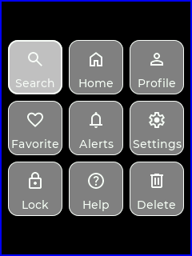
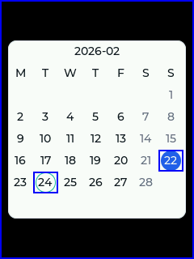
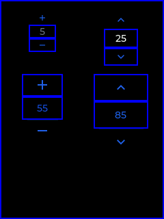
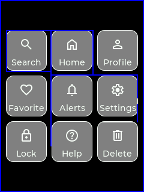
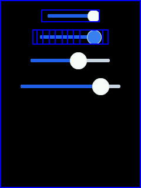
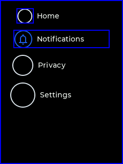
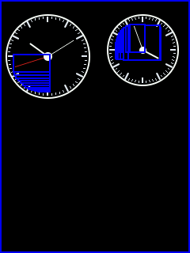
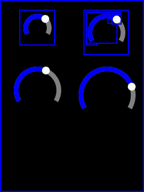
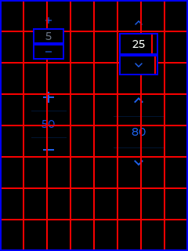

# 脏区域接口设计说明

## 目标

`egui_view_invalidate()` 可以安全地让整个控件失效，但很多基础控件的变化其实只发生在局部区域。

如果继续整控件刷新，会带来三类额外开销：

- dirty area 变大，PFB 需要覆盖更多 tile
- `on_draw()` 里会做更多无效计算
- 高频交互或动画时，刷新面积明显大于真实变化面积

因此框架补充了一组更细粒度的 dirty-region 接口，让控件作者可以按控件结构主动描述“哪里变了”。

这组接口的重点不是让框架自动推导任意几何图形，而是让控件作者用简单、稳定、可维护的方式，把业务语义映射成一组矩形脏区。

## 接口分层

### 1. 整控件失效

入口：`egui_view_invalidate()`

实现位置：`src/widget/egui_view.c`

这是最基础、最安全的接口，适合：

- 尺寸、位置、padding、margin 变化
- 文本重排、换行范围变化
- 主题整体切换
- 整个控件视觉结构都发生变化

这种模式下，框架会把控件的 `region_screen` 加入 dirty list，并参与后续的 PFB 刷新。

### 2. 局部矩形失效

入口：`egui_view_invalidate_region(egui_view_t *self, const egui_region_t *dirty_region)`

实现位置：`src/widget/egui_view.c`

`dirty_region` 使用控件本地坐标。框架内部会自动完成：

1. 转换到 screen 坐标
2. 与控件 `region_screen` 相交裁剪
3. 合并进全局 dirty list

适合：

- 光标闪烁
- 单个 cell 高亮
- knob、thumb、badge 这类局部变化
- 圆弧末端、小面积数值区变化

示例：

```c
EGUI_REGION_DEFINE(dirty_region, x, y, width, height);
egui_view_invalidate_region(self, &dirty_region);
```

### 3. 固定子区域失效

入口：`egui_view_invalidate_sub_region(egui_view_t *self, const egui_sub_region_table_t *table, uint16_t index)`

实现位置：`src/widget/egui_view.c`

当控件内部存在稳定分区时，推荐先把这些分区整理成表，再按索引触发失效。

适合：

- calendar 的日期格
- number picker 的上、中、下区域
- button matrix / segmented control / tab 的固定 cell

优势是“区域语义稳定”，不用每次重新推坐标，控件内部也更容易维护。

### 4. 圆形 / 圆弧类辅助接口

头文件：`src/widget/egui_view_circle_dirty.h`

这组 helper 不是新的刷新入口，而是帮助圆形控件快速构造局部 dirty region。

核心函数：

- `egui_view_circle_dirty_compute_arc_region()`
- `egui_view_circle_dirty_add_circle_region()`
- `egui_view_circle_dirty_add_line_region()`
- `egui_view_circle_dirty_add_rect_region()`
- `egui_view_circle_dirty_union_region()`
- `egui_view_circle_dirty_get_circle_point()`

它们已经被用于：

- `egui_view_arc_slider.c`
- `egui_view_circular_progress_bar.c`
- `egui_view_gauge.c`
- `egui_view_spinner.c`
- `egui_view_analog_clock.c`
- `egui_view_checkbox.c`
- `egui_view_radio_button.c`

这类控件的共性是：真实变化往往只沿圆弧、指针、thumb 周围展开，没有必要每次刷新整个外接矩形。

### 5. 绘制阶段跳过无效计算

入口：`egui_canvas_is_region_active(const egui_region_t *region)`

实现位置：`src/core/egui_canvas.h`

前面的接口解决的是“哪些区域加入 dirty list”，但这还不够。

如果 `on_draw()` 内部仍然无条件遍历所有子元素，那么 CPU 计算开销还是会偏大。`egui_canvas_is_region_active()` 用来判断某个屏幕区域是否与当前 PFB tile 相交，从而在绘制阶段直接跳过无关子区域。

适合：

- 文本测量和格式化
- 大量 cell 循环
- 渐变、阴影、圆弧等成本较高的绘制逻辑

示例：

```c
EGUI_REGION_DEFINE(screen_region, x, y, width, height);
if (egui_canvas_is_region_active(&screen_region))
{
    draw_expensive_part();
}
```

## 推荐使用顺序

建议按下面的顺序做控件优化：

1. 先判断是否真的只有局部区域变化
2. 能用稳定矩形描述，就优先用 `egui_view_invalidate_region()`
3. 如果控件存在固定分区，再进一步整理成 `sub_region_table`
4. 圆弧、圆点、指针类几何变化，优先复用 `egui_view_circle_dirty.h`
5. 在 `on_draw()` 中对高成本子区域补 `egui_canvas_is_region_active()`
6. 一旦涉及布局、重排或整页变化，回退到 `egui_view_invalidate()`

## 运行截图

下面的截图使用 `EGUI_CONFIG_DEBUG_DIRTY_REGION_REFRESH=1` 录制。蓝色框表示本帧触发的 dirty region。

如果一张图同时打开了 `EGUI_CONFIG_DEBUG_PFB_REFRESH=1`，那么红色网格表示 PFB tile，蓝色框仍然表示 dirty region。

### 接口速查

| 接口 / helper | 典型场景 | 代表控件 |
| --- | --- | --- |
| `egui_view_invalidate()` | 整控件首次布局、结构整体变化 | `button_matrix` |
| `egui_view_invalidate_region()` | 单个日期格、单个 zone、局部 cell 变化 | `mini_calendar` / `number_picker` / `button_matrix` |
| `egui_view_invalidate_sub_region()` | 固定分区控件，预定义子区域表后按索引失效 | `number_picker` / `calendar` 一类固定分区控件 |
| `egui_view_circle_dirty_add_rect_region()` | 横向 track、小矩形高亮、局部文本区 | `slider` / `progress_bar` / `checkbox` |
| `egui_view_circle_dirty_add_circle_region()` | thumb、圆点、圆形选中标记 | `slider` / `radio_button` / `led` |
| `egui_view_circle_dirty_add_line_region()` | 指针、表针、线段变化 | `analog_clock` / `gauge` |
| `egui_view_circle_dirty_compute_arc_region()` | 圆弧 sweep 改变 | `arc_slider` / `spinner` / `circular_progress_bar` |
| `egui_canvas_is_region_active()` | `on_draw()` 按 tile 跳过无关子区域 | `number_picker` / `mini_calendar` / `textinput` |

### `egui_view_invalidate()`：整控件失效

首次布局时，整个控件区域进入 dirty list，这是正常行为，也是最保守、最安全的失效方式。



### `egui_view_invalidate_region()`：局部矩形失效

`mini_calendar` 在日期切换时，只让旧日期格和新日期格失效。这类“矩形边界稳定”的局部变化，最适合直接调用 `egui_view_invalidate_region()`。



### `egui_view_invalidate_sub_region()`：固定分区控件的推荐场景

`number_picker` 这类控件天然分成上、中、下三个稳定区域。当前实现直接构造局部矩形，但从接口设计角度看，这正是 `sub_region_table` 的典型使用场景：先预定义固定分区，再按索引触发失效。

对用户自定义控件，如果内部区域长期稳定，优先考虑把这些区域抽象成 `egui_view_invalidate_sub_region()` 对应的子区域表。



### 固定 cell 场景：多个局部区域合并后再失效

`button_matrix` 点击后，会把旧选中项和新选中项对应的 cell 合并后再上报。这个场景说明了一个常见模式：控件作者先按业务结构拆出局部区域，再统一合并为最终 dirty region。



### `add_rect_region()` + `add_circle_region()`：滑块类控件

`slider` 的变化同时包含 track 差异区和 thumb 前后位置，因此会把矩形区域和圆形区域一起并入脏区。这个模式适合所有“横向/纵向轨道 + 圆形滑块”的控件。



### `add_circle_region()`：圆点 / 单选标记类控件

`radio_button` 的变化集中在左侧圆形标记区。对这类“圆形选中态、圆点指示器、LED 状态灯”控件，`add_circle_region()` 是最直接的 helper。



### `add_line_region()`：表针 / 指针类控件

`analog_clock` 的秒针或分针变化，本质上是线段从旧位置切换到新位置。这里用 `add_line_region()` 把旧针位和新针位都覆盖进去，可以明显缩小相对整控件刷新的面积。



### `compute_arc_region()`：圆弧 sweep 变化

`arc_slider` 会同时计算旧圆弧、新圆弧以及 thumb 前后位置，再通过 `egui_view_invalidate_region()` 上报局部脏区。对 sweep 较大的拖动，外接矩形仍可能覆盖较大面积，但它依然比无条件整控件失效更可控。



### `egui_canvas_is_region_active()`：绘制阶段按 tile 跳过无关区域

这个 helper 不会直接改变蓝色脏区边框，它影响的是 `on_draw()` 内部的计算路径。

下面这张图同时打开了 PFB 和 dirty-region 调试。可以看到 `number_picker` 只在少量 tile 上参与本轮刷新。`egui_canvas_is_region_active()` 的作用，就是让控件在进入这些 tile 时再去绘制对应区域，其余 tile 直接跳过，避免无意义的文字测量和子区域绘制。



### 圆形 helper 的组合关系

`egui_view_circle_dirty.h` 里还有两个组合型 helper：

- `egui_view_circle_dirty_union_region()`：把多个局部矩形合并成最终 dirty region，常和上面的 `add_*_region()` 配合使用
- `egui_view_circle_dirty_get_circle_point()`：先算出圆弧末端、指针端点或 thumb 位置，再把这些点扩成 circle / line / arc 脏区

它们通常不单独对应一张截图，而是作为 `arc_slider`、`analog_clock`、`gauge` 这类控件内部的拼装工具一起出现。

## 接口优势

### 1. 控件作者最清楚哪里变了

框架不需要做复杂的自动推导。控件作者直接按控件结构给出脏区，算法简单，行为稳定，适合资源受限平台。

### 2. 明显降低 dirty area

dirty area 变小后，参与刷新的 PFB tile 数也会下降，SPI 传输和像素填充都能同步受益。

### 3. 降低 `on_draw()` 的无效计算

`egui_canvas_is_region_active()` 让复杂控件可以按 tile 级别跳过无关子区域，不只是“少刷像素”，也能“少算逻辑”。

### 4. 易回退，风险可控

只要发现控件局部优化开始影响可维护性，随时可以回退到 `egui_view_invalidate()`。接口层次清晰，控件可以逐步优化，不需要一次性做复杂重构。

### 5. 适合做通用 helper

圆弧、圆点、指针、固定 cell 这些模式一旦沉淀成 helper，后续基础控件可以直接复用，能持续提升整个控件库的动态性能。

## 调试建议

推荐按下面的顺序观察 dirty-region 行为：

1. 打开 `EGUI_CONFIG_DEBUG_DIRTY_REGION_REFRESH=1`，直接看蓝框覆盖范围
2. 打开 `EGUI_CONFIG_DEBUG_DIRTY_REGION_TRACE=1`，确认脏区来源
3. 打开 `EGUI_CONFIG_DEBUG_DIRTY_REGION_STATS=1`，看 `dirty_area` 和 `pfb_tiles`
4. 最终再回到 QEMU 做真实性能确认

如果想看更完整的调优方法，可继续参考：

- [脏区域细粒度优化指南](dirty_region_tuning.md)
- [脏矩形机制原理](../architecture/dirty_rect.md)
