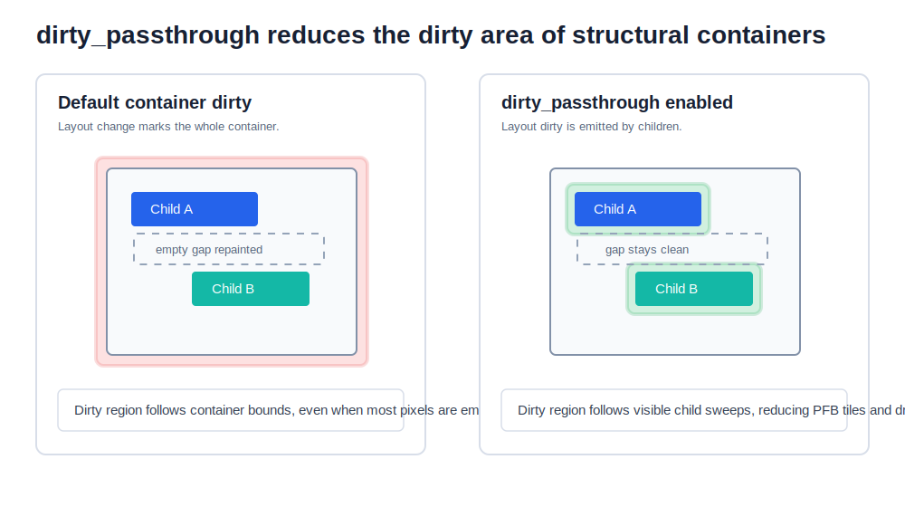
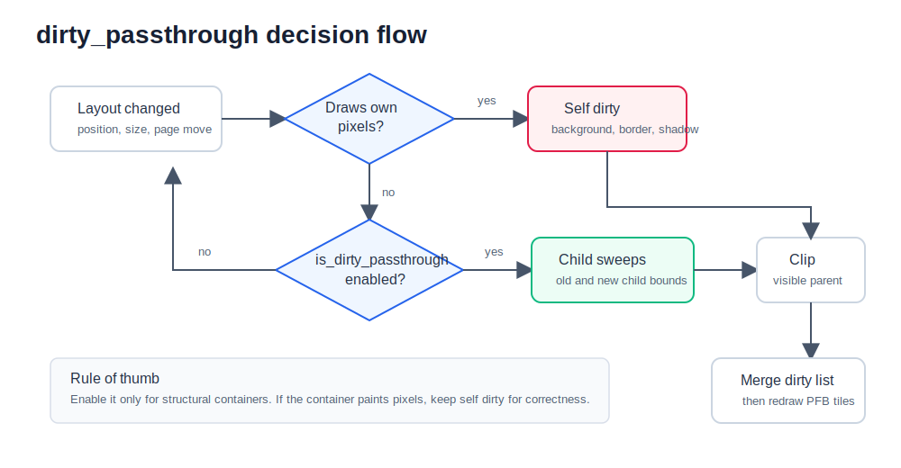
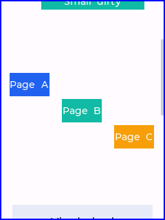
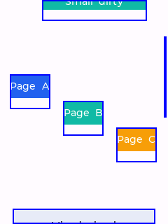
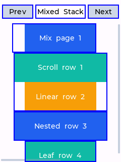
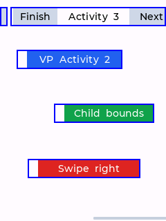
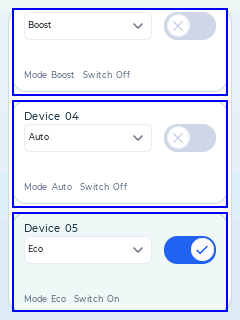
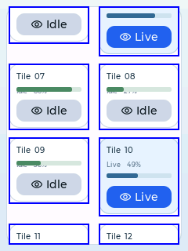

# `is_dirty_passthrough` 结构容器脏区透传

## 作用概述

`is_dirty_passthrough` 是 `egui_view_t` 内部的结构容器标记。它表示一个容器本身不绘制像素，只负责组织、裁剪或布局子控件。对外使用时不要直接改结构体字段，应通过 API 开关：

```c
egui_view_set_dirty_passthrough(view, 1);
egui_view_get_dirty_passthrough(view);
```

该能力受编译宏 `EGUI_CONFIG_FUNCTION_SUPPORT_DIRTY_PASSTHROUGH` 管理，框架默认值为 `0`。默认关闭时，`egui_view_set_dirty_passthrough()` 会退化为 no-op，`egui_view_get_dirty_passthrough()` 固定返回 `0`，结构体内部的 `is_dirty_passthrough` 字段和透传脏区路径也不会参与编译。需要使用该优化的 app 或例程应在自己的 `app_egui_config.h` 中显式打开：

```c
#ifndef EGUI_CONFIG_FUNCTION_SUPPORT_DIRTY_PASSTHROUGH
#define EGUI_CONFIG_FUNCTION_SUPPORT_DIRTY_PASSTHROUGH 1
#endif
```

当前 `HelloBasic/dirty_passthrough_*`、`HelloVirtual/*_basic` 中用于展示 Virtual list / grid / viewport holder 优化的例程，以及 `HelloUnitTest` 的相关测试会按需开启该宏。普通应用不需要该优化时可以保持默认关闭。

开启后，当容器因为 layout、滚动、翻页或父级平移产生脏区时，框架不再默认把容器整块 `region_screen` 加入 dirty list，而是把脏区透传到子控件，按子控件旧位置和新位置的扫过范围生成脏矩形。

这解决的是结构容器常见的浪费：容器很大，但真正有像素的子控件很少。如果仍按整容器刷新，会重绘大量空白区域。



## 为什么能提升性能

EmbeddedGUI 使用局部帧缓冲 PFB 刷新。dirty area 越大，后续需要处理的工作越多：

- dirty list 覆盖更多像素区域。
- PFB 需要遍历更多 tile。
- `on_draw()` 更容易被更多控件和更多 tile 触发。
- SPI / LCD 刷新面积可能变大。

`dirty_passthrough` 的优化路径是减少无效脏区，而不是改变控件绘制结果。它把“容器变化”拆成“子控件扫过区域变化”，使空白间隔保持干净。

例如单元测试中的稀疏垂直容器场景：

- baseline：容器尺寸是 `100 x 160`，移动时容易覆盖整块结构区域。
- passthrough：容器中只有两个 `100 x 20` 子控件，移动时只需要两个子控件扫过区域。
- 单元测试要求 passthrough 面积不超过 baseline 的一半，并确认两个子控件之间的空白点不在 dirty list 内。

嵌套结构页场景更明显：父容器和页面容器都只是结构节点时，passthrough 面积要求不超过 baseline 的四分之一。

## 框架决策流程

`dirty_passthrough` 只影响 layout 类脏区的分发逻辑。框架大致按下面的路径判断：



关键规则：

- 容器自身绘制 background、边框、阴影或其他像素时，必须保留容器自身脏区。
- 容器只是结构节点时，可以向子控件透传。
- 子控件脏区会继续被可见父节点裁剪，避免滚动视口外的区域进入 dirty list。
- 多个小脏区最终仍会经过 dirty list 合并；如果 `EGUI_CONFIG_DIRTY_AREA_COUNT` 太小，多个小区域可能被合并成较大的区域。

## 适用场景

适合开启的对象通常满足两个条件：自身不绘制像素，视觉变化完全来自子控件。

常见适用场景：

| 场景 | 典型收益 |
|------|----------|
| `egui_view_group_t` 结构容器 | 平移或布局变化时只刷新子控件扫过区域 |
| `egui_view_linearlayout_t` | 稀疏布局中跳过子控件间距 |
| `egui_view_scroll_t` 的内部内容层 | 滚动时只刷新可见子控件扫过区域 |
| `egui_view_viewpage_t` 的页面容器 | 翻页动画中按页面内子控件生成脏区 |
| Page / Activity root | 切换或移动时避免整屏结构节点刷成全屏脏区 |
| Virtual viewport / list / grid holder | 复用 holder 时避免 idle layout 和容器空白反复刷新 |

不适合开启的对象：

- 容器有 background，并且容器自身位置或尺寸会变化。
- 容器负责绘制装饰、边框、分割线、阴影或遮罩。
- 容器自身的像素和子控件像素混合在一起，无法只靠子控件脏区保证正确刷新。
- 子控件数量非常多且区域极度碎片化，dirty list 容量不足时可能频繁合并。

带 background 的 scroll 容器有一个例外：如果 scroll 容器相对父节点的位置和尺寸不变，只是内部内容移动，背景本身没有变化，此时仍可以只刷新子控件脏区。当前单元测试已经覆盖 `scroll with background stable drag` 这类场景。

## 运行效果图

下面的截图来自 `HelloBasic` 和 `HelloVirtual` 例程，均开启 dirty region 调试显示。蓝色边框表示当前帧参与刷新的脏区。

### 结构容器对比

关闭 passthrough 后，结构容器移动更容易表现为整块区域刷新，空白间隔也会被包含进去：



开启 passthrough 后，脏区落在子控件扫过的区域上，子控件之间的大块空白不再刷新：



对应例程：

```bash
python scripts/code_runtime_check.py --app HelloBasic --app-sub dirty_passthrough_container --keep-screenshots
```

关闭 passthrough 对照：

```bash
python scripts/code_runtime_check.py --app HelloBasic --app-sub dirty_passthrough_container --keep-screenshots --user-cflags=-DDIRTY_PASSTHROUGH_CONTAINER_DEMO_BASELINE=1
```

### Page 混合场景

真实多 Page 示例中，第四页是 `ViewPage + Scroll + LinearLayout` 的混合结构。拖动时脏区只覆盖可见子控件扫过区域，而不是整页或整屏。



上图选自非首帧的混合页切换过程。蓝色脏区贴着 `Mix page` 和下方可见行的扫过范围，没有覆盖顶部导航以外的整页空白。

对应例程：

```bash
python scripts/code_runtime_check.py --app HelloBasic --app-sub dirty_passthrough_page --keep-screenshots
```

### Activity 场景

Activity 示例覆盖真实 Activity 栈切换，以及 Sparse、LinearLayout、ViewPage、ViewPage + Scroll + LinearLayout 四类页面结构。Activity root 自身是结构节点时，切换和移动可以避免无意义的整屏结构脏区。



上图选自 Activity 3 的 ViewPage 交互过程。脏区只落在 header 局部和页面内子控件扫过范围，没有出现整屏 dirty。

对应例程：

```bash
python scripts/code_runtime_check.py --app HelloBasic --app-sub dirty_passthrough_activity --keep-screenshots
```

### Virtual list / grid holder

Virtual 例程中，holder root 也可以作为结构容器开启 passthrough。这样滚动、复用、布局稳定后的 idle frame 都不会因为 holder 容器本身反复刷新空白区域。

List holder 滚动帧：



Grid holder 滚动帧：



这两张图都选自滚动后的非首帧，蓝色脏区按 holder 单元覆盖，没有回退成整屏刷新。

对应例程：

```bash
python scripts/code_runtime_check.py --app HelloVirtual --app-sub grid_view_basic --keep-screenshots
python scripts/code_runtime_check.py --app HelloVirtual --app-sub list_view_basic --keep-screenshots
```

## 使用建议

### 1. 对结构容器显式开启

```c
egui_view_group_init(EGUI_VIEW_OF(&group), core);
egui_view_set_dirty_passthrough(EGUI_VIEW_OF(&group), 1);
```

`Linearlayout`、Page root、Activity root、ViewPage page、Virtual holder 等结构节点可以按这个方式设置。内置控件中已有的透传设置也依赖 `EGUI_CONFIG_FUNCTION_SUPPORT_DIRTY_PASSTHROUGH=1` 才会生效；宏关闭时这些设置保持可编译但不改变脏区行为。

### 2. 子控件仍按自己的 dirty 规则工作

`dirty_passthrough` 不替代局部脏区接口。它只改变结构容器的 layout 脏区分发。基础控件内部的小范围变化仍应使用：

- `egui_view_invalidate_region()`
- `egui_view_invalidate_sub_region()`
- 圆形控件的 dirty helper

这样才能同时减少“容器空白刷新”和“控件内部无效刷新”。

### 3. background 场景先判断自身是否变化

如果容器带 background：

- 容器自身位置或尺寸变化：需要刷新容器自身 swept 区域。
- 容器位置和尺寸不变，只有内部子控件滚动：可以只刷新子控件扫过区域。
- background 参数、颜色、圆角等视觉属性变化：应刷新容器自身完整区域。

### 4. 注意 dirty list 容量

passthrough 会把一个大脏区拆成多个小脏区。通常这能减少 PFB tile，但如果子控件特别多，且 `EGUI_CONFIG_DIRTY_AREA_COUNT` 太小，dirty list 可能合并成较大区域。调试时需要同时看：

- `regions`
- `dirty_area`
- `pfb_tiles`
- `DIRTY_SOURCE` 来源

## 调试方法

建议在例程或临时构建中开启：

```c
#define EGUI_CONFIG_DEBUG_DIRTY_REGION_REFRESH 1
#define EGUI_CONFIG_DEBUG_DIRTY_REGION_STATS   1
#define EGUI_CONFIG_DEBUG_DIRTY_REGION_TRACE   1
```

日志中常见来源：

| 来源 | 含义 |
|------|------|
| `dirty_passthrough_swept` | 子控件旧位置和新位置的扫过区域 |
| `dirty_passthrough_self` | 容器自身必须刷新，例如 background 或自身像素变化 |
| `layout` | 普通 layout 触发的整控件脏区 |
| `subregion` | 控件内部主动触发的局部脏区 |

如果开启 passthrough 后仍然出现全屏脏区，优先检查：

- 是否有 root、page、activity 或普通容器没有开启 passthrough。
- 是否有带 background 的容器正在移动或改变尺寸。
- 是否有全屏控件主动调用了 `egui_view_invalidate()`。
- 是否因为 dirty slot 数量不足导致多个小脏区被合并。

## 验证覆盖

当前单元测试覆盖了以下关键场景：

- 普通 group 平移、尺寸变化、空容器、可见性变化。
- background 容器移动、尺寸变化、稳定背景下内部滚动。
- Scroll、ViewPage、LinearLayout 混合结构。
- Page root 和 Activity root。
- Virtual viewport、Virtual list、Virtual grid holder。
- 稀疏垂直列表、水平分页、嵌套结构页的面积收益对比。
- idle layout 不再重复产生 dirty 的 Virtual viewport/list/grid 场景。

推荐回归命令：

```bash
make all APP=HelloUnitTest PORT=pc_test EGUI_APP_ROOT_PATH=example
output\main.exe
python scripts/code_runtime_check.py --app HelloBasic --app-sub dirty_passthrough_container --keep-screenshots
python scripts/code_runtime_check.py --app HelloBasic --app-sub dirty_passthrough_page --keep-screenshots
python scripts/code_runtime_check.py --app HelloBasic --app-sub dirty_passthrough_activity --keep-screenshots
python scripts/code_runtime_check.py --scope virtual --jobs 2 --keep-screenshots
```

PC 截图适合确认脏区覆盖是否合理；如果要把收益写成性能数据，仍应使用 QEMU 做基准测试。
