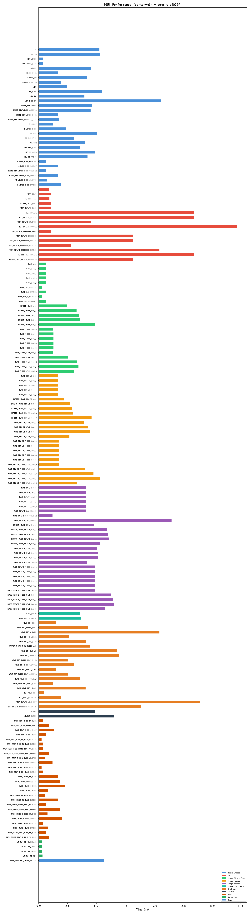

# Performance Report

- Commit: `a4092f1`
- Date: 2026-03-22T14:53:08.313718
- Profile: cortex-m3

## Basic Shapes

| Test Case | Time (ms) |
|-----------|-----------|
| LINE | 5.274 |
| LINE_HQ | 5.316 |
| RECTANGLE | 0.391 |
| RECTANGLE_FILL | 0.395 |
| CIRCLE | 4.560 |
| CIRCLE_FILL | 1.648 |
| CIRCLE_HQ | 4.203 |
| CIRCLE_FILL_HQ | 1.957 |
| ARC | 2.466 |
| ARC_FILL | 5.491 |
| ARC_HQ | 3.972 |
| ARC_FILL_HQ | 10.626 |
| ROUND_RECTANGLE | 4.606 |
| ROUND_RECTANGLE_CORNERS | 4.495 |
| ROUND_RECTANGLE_FILL | 1.690 |
| ROUND_RECTANGLE_CORNERS_FILL | 1.740 |
| TRIANGLE | 1.216 |
| TRIANGLE_FILL | 2.361 |
| ELLIPSE | 5.049 |
| ELLIPSE_FILL | 3.039 |
| POLYGON | 4.057 |
| POLYGON_FILL | 3.591 |
| BEZIER_QUAD | 4.910 |
| BEZIER_CUBIC | 4.232 |
| CIRCLE_FILL_QUARTER | 0.633 |
| CIRCLE_FILL_DOUBLE | 1.673 |
| ROUND_RECTANGLE_FILL_QUARTER | 0.659 |
| ROUND_RECTANGLE_FILL_DOUBLE | 1.712 |
| TRIANGLE_FILL_QUARTER | 0.702 |
| TRIANGLE_FILL_DOUBLE | 1.920 |

## Text

| Test Case | Time (ms) |
|-----------|-----------|
| TEXT | 0.919 |
| TEXT_RECT | 1.044 |
| EXTERN_TEXT | 0.935 |
| EXTERN_TEXT_RECT | 1.073 |
| TEXT_ROTATE_NONE | 1.062 |
| TEXT_ROTATE | 13.418 |
| TEXT_ROTATE_RESIZE | 13.419 |
| TEXT_ROTATE_QUARTER | 4.529 |
| TEXT_ROTATE_DOUBLE | 17.177 |
| TEXT_ROTATE_BUFFERED_NONE | 1.062 |
| TEXT_ROTATE_BUFFERED | 8.164 |
| TEXT_ROTATE_BUFFERED_RESIZE | 8.164 |
| TEXT_ROTATE_BUFFERED_QUARTER | 2.790 |
| TEXT_ROTATE_BUFFERED_DOUBLE | 10.465 |
| EXTERN_TEXT_ROTATE | 13.424 |
| EXTERN_TEXT_ROTATE_BUFFERED | 8.164 |

## Image Direct Draw

| Test Case | Time (ms) |
|-----------|-----------|
| IMAGE_565 | 0.660 |
| IMAGE_565_1 | 0.663 |
| IMAGE_565_2 | 0.663 |
| IMAGE_565_4 | 0.663 |
| IMAGE_565_8 | 0.663 |
| IMAGE_565_QUARTER | 0.322 |
| IMAGE_565_DOUBLE | 0.660 |
| IMAGE_565_8_QUARTER | 0.323 |
| IMAGE_565_8_DOUBLE | 0.663 |
| EXTERN_IMAGE_565 | 2.460 |
| EXTERN_IMAGE_565_1 | 3.283 |
| EXTERN_IMAGE_565_2 | 3.466 |
| EXTERN_IMAGE_565_4 | 3.545 |
| EXTERN_IMAGE_565_8 | 4.858 |
| IMAGE_TILED_565_0 | 1.275 |
| IMAGE_TILED_565_1 | 1.283 |
| IMAGE_TILED_565_2 | 1.283 |
| IMAGE_TILED_565_4 | 1.283 |
| IMAGE_TILED_565_8 | 1.283 |
| IMAGE_TILED_STAR_565_0 | 1.275 |
| IMAGE_TILED_STAR_565_1 | 2.567 |
| IMAGE_TILED_STAR_565_2 | 3.308 |
| IMAGE_TILED_STAR_565_4 | 3.455 |
| IMAGE_TILED_STAR_565_8 | 3.078 |

## Image Resize

| Test Case | Time (ms) |
|-----------|-----------|
| IMAGE_RESIZE_565 | 1.648 |
| IMAGE_RESIZE_565_1 | 1.651 |
| IMAGE_RESIZE_565_2 | 1.651 |
| IMAGE_RESIZE_565_4 | 1.651 |
| IMAGE_RESIZE_565_8 | 1.651 |
| EXTERN_IMAGE_RESIZE_565 | 2.173 |
| EXTERN_IMAGE_RESIZE_565_1 | 2.706 |
| EXTERN_IMAGE_RESIZE_565_2 | 2.893 |
| EXTERN_IMAGE_RESIZE_565_4 | 2.988 |
| EXTERN_IMAGE_RESIZE_565_8 | 4.582 |
| IMAGE_RESIZE_STAR_565_1 | 3.916 |
| IMAGE_RESIZE_STAR_565_2 | 4.306 |
| IMAGE_RESIZE_STAR_565_4 | 4.490 |
| IMAGE_RESIZE_STAR_565_8 | 2.674 |
| IMAGE_RESIZE_TILED_565_0 | 1.759 |
| IMAGE_RESIZE_TILED_565_1 | 1.763 |
| IMAGE_RESIZE_TILED_565_2 | 1.763 |
| IMAGE_RESIZE_TILED_565_4 | 1.763 |
| IMAGE_RESIZE_TILED_565_8 | 1.763 |
| IMAGE_RESIZE_TILED_STAR_565_0 | 1.759 |
| IMAGE_RESIZE_TILED_STAR_565_1 | 4.015 |
| IMAGE_RESIZE_TILED_STAR_565_2 | 4.751 |
| IMAGE_RESIZE_TILED_STAR_565_4 | 5.282 |
| IMAGE_RESIZE_TILED_STAR_565_8 | 3.296 |

## Image Rotate

| Test Case | Time (ms) |
|-----------|-----------|
| IMAGE_ROTATE_565 | 4.082 |
| IMAGE_ROTATE_565_1 | 4.082 |
| IMAGE_ROTATE_565_2 | 4.082 |
| IMAGE_ROTATE_565_4 | 4.082 |
| IMAGE_ROTATE_565_8 | 4.082 |
| IMAGE_ROTATE_565_RESIZE | 4.082 |
| IMAGE_ROTATE_565_QUARTER | 1.210 |
| IMAGE_ROTATE_565_DOUBLE | 11.516 |
| EXTERN_IMAGE_ROTATE_565 | 4.830 |
| EXTERN_IMAGE_ROTATE_565_1 | 5.890 |
| EXTERN_IMAGE_ROTATE_565_2 | 6.018 |
| EXTERN_IMAGE_ROTATE_565_4 | 6.078 |
| EXTERN_IMAGE_ROTATE_565_8 | 5.345 |
| IMAGE_ROTATE_STAR_565_1 | 5.078 |
| IMAGE_ROTATE_STAR_565_2 | 5.161 |
| IMAGE_ROTATE_STAR_565_4 | 5.130 |
| IMAGE_ROTATE_STAR_565_8 | 4.220 |
| IMAGE_ROTATE_TILED_565_0 | 4.860 |
| IMAGE_ROTATE_TILED_565_1 | 4.862 |
| IMAGE_ROTATE_TILED_565_2 | 4.862 |
| IMAGE_ROTATE_TILED_565_4 | 4.862 |
| IMAGE_ROTATE_TILED_565_8 | 4.862 |
| IMAGE_ROTATE_TILED_STAR_565_0 | 4.860 |
| IMAGE_ROTATE_TILED_STAR_565_1 | 6.300 |
| IMAGE_ROTATE_TILED_STAR_565_2 | 6.463 |
| IMAGE_ROTATE_TILED_STAR_565_4 | 6.538 |
| IMAGE_ROTATE_TILED_STAR_565_8 | 5.713 |

## Image Color Tint

| Test Case | Time (ms) |
|-----------|-----------|
| IMAGE_COLOR | 3.554 |
| IMAGE_RESIZE_COLOR | 3.650 |

## Gradient

| Test Case | Time (ms) |
|-----------|-----------|
| GRADIENT_RECT | 1.513 |
| GRADIENT_ROUND_RECT | 4.278 |
| GRADIENT_CIRCLE | 10.460 |
| GRADIENT_TRIANGLE | 2.628 |
| GRADIENT_ARC_RING | 4.130 |
| GRADIENT_ARC_RING_ROUND_CAP | 4.452 |
| GRADIENT_RADIAL | 6.756 |
| GRADIENT_ANGULAR | 6.935 |
| GRADIENT_ROUND_RECT_RING | 2.545 |
| GRADIENT_LINE_CAPSULE | 3.050 |
| GRADIENT_MULTI_STOP | 1.528 |
| GRADIENT_ROUND_RECT_CORNERS | 2.564 |
| IMAGE_GRADIENT_OVERLAY | 3.551 |
| MASK_GRADIENT_RECT_FILL | 1.230 |
| MASK_GRADIENT_IMAGE | 4.068 |
| TEXT_GRADIENT | 0.449 |
| TEXT_RECT_GRADIENT | 1.920 |
| TEXT_ROTATE_GRADIENT | 13.997 |
| TEXT_ROTATE_BUFFERED_GRADIENT | 8.837 |

## Shadow

| Test Case | Time (ms) |
|-----------|-----------|
| SHADOW | 4.871 |
| SHADOW_ROUND | 6.554 |

## Mask

| Test Case | Time (ms) |
|-----------|-----------|
| MASK_RECT_FILL_NO_MASK | 0.395 |
| MASK_RECT_FILL_ROUND_RECT | 0.934 |
| MASK_RECT_FILL_CIRCLE | 1.333 |
| MASK_RECT_FILL_IMAGE | 0.612 |
| MASK_RECT_FILL_NO_MASK_QUARTER | 0.256 |
| MASK_RECT_FILL_NO_MASK_DOUBLE | 0.394 |
| MASK_RECT_FILL_ROUND_RECT_QUARTER | 0.394 |
| MASK_RECT_FILL_ROUND_RECT_DOUBLE | 0.925 |
| MASK_RECT_FILL_CIRCLE_QUARTER | 0.520 |
| MASK_RECT_FILL_CIRCLE_DOUBLE | 1.209 |
| MASK_RECT_FILL_IMAGE_QUARTER | 0.250 |
| MASK_RECT_FILL_IMAGE_DOUBLE | 0.372 |
| MASK_IMAGE_NO_MASK | 1.651 |
| MASK_IMAGE_ROUND_RECT | 1.858 |
| MASK_IMAGE_CIRCLE | 2.297 |
| MASK_IMAGE_IMAGE | 0.778 |
| MASK_IMAGE_NO_MASK_QUARTER | 0.580 |
| MASK_IMAGE_NO_MASK_DOUBLE | 1.650 |
| MASK_IMAGE_ROUND_RECT_QUARTER | 0.634 |
| MASK_IMAGE_ROUND_RECT_DOUBLE | 1.852 |
| MASK_IMAGE_CIRCLE_QUARTER | 0.774 |
| MASK_IMAGE_CIRCLE_DOUBLE | 2.046 |
| MASK_IMAGE_IMAGE_QUARTER | 0.354 |
| MASK_IMAGE_IMAGE_DOUBLE | 0.778 |
| MASK_ROUND_RECT_FILL_NO_MASK | 0.614 |
| MASK_ROUND_RECT_FILL_WITH_MASK | 0.934 |

## Animation

| Test Case | Time (ms) |
|-----------|-----------|
| ANIMATION_TRANSLATE | 0.276 |
| ANIMATION_ALPHA | 0.270 |
| ANIMATION_SCALE | 0.300 |
| ANIMATION_SET | 0.336 |

## Other

| Test Case | Time (ms) |
|-----------|-----------|
| MASK_GRADIENT_IMAGE_ROTATE | 5.681 |
