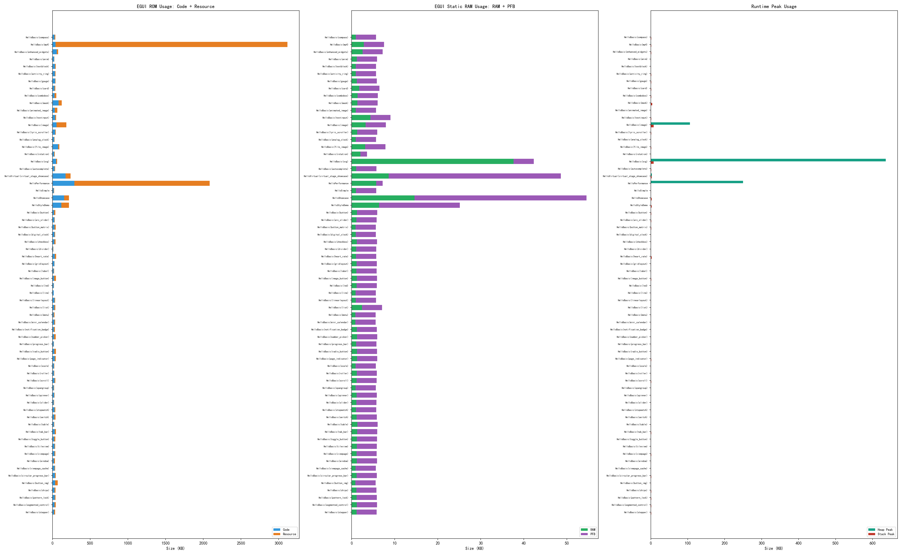

# Binary Size Report

- Commit: `8bb09fb`
- Date: 2026-03-13T21:19:43.440543
- Platform: STM32G0 (Cortex-M0+, stm32g0_empty)
- Total apps: 75

## Overview

- Smallest Code: **HelloBasic(divider)** (15184 bytes)
- Largest Code: **HelloShowcase** (133576 bytes)
- Smallest RAM: **HelloBasic(image)** (904 bytes)
- Largest RAM: **HelloShowcase** (16480 bytes)

## ROM Usage (Code + Resource)

## Detailed Size Table

| App | Code (Bytes) | Resource (Bytes) | RAM (Bytes) | PFB (Bytes) | Total ROM (Bytes) |
|-----|-------------|-----------------|------------|------------|------------------|
| HelloActivity | 30848 | 11224 | 1696 | 2400 | 42072 |
| HelloAPP | 59656 | 78636 | 1640 | 2400 | 138292 |
| HelloBasic(activity_ring) | 34108 | 5856 | 1060 | 2400 | 39964 |
| HelloBasic(analog_clock) | 30132 | 4680 | 1060 | 2400 | 34812 |
| HelloBasic(anim) | 24984 | 4188 | 1316 | 2400 | 29172 |
| HelloBasic(animated_image) | 43680 | 33596 | 1020 | 2400 | 77276 |
| HelloBasic(arc_slider) | 27884 | 5144 | 1228 | 2400 | 33028 |
| HelloBasic(autocomplete) | 32212 | 9468 | 1572 | 2400 | 41680 |
| HelloBasic(button) | 21892 | 10572 | 1312 | 2400 | 32464 |
| HelloBasic(button_img) | 46972 | 38112 | 928 | 2400 | 85084 |
| HelloBasic(button_matrix) | 24336 | 9264 | 996 | 2400 | 33600 |
| HelloBasic(card) | 27536 | 10828 | 1952 | 2400 | 38364 |
| HelloBasic(checkbox) | 28032 | 10532 | 1264 | 2400 | 38564 |
| HelloBasic(chips) | 27824 | 9472 | 1556 | 2400 | 37296 |
| HelloBasic(circular_progress_bar) | 29944 | 18212 | 1244 | 2400 | 48156 |
| HelloBasic(combobox) | 29492 | 9396 | 1344 | 2400 | 38888 |
| HelloBasic(compass) | 32676 | 10532 | 1084 | 2400 | 43208 |
| HelloBasic(digital_clock) | 27028 | 9364 | 1036 | 2400 | 36392 |
| HelloBasic(divider) | 15184 | 420 | 1148 | 2400 | 15604 |
| HelloBasic(enhanced_widgets) | 59172 | 11600 | 2628 | 2400 | 70772 |
| HelloBasic(gauge) | 39324 | 14064 | 1292 | 2400 | 53388 |
| HelloBasic(gridlayout) | 21164 | 4940 | 1200 | 2400 | 26104 |
| HelloBasic(heart_rate) | 35628 | 20596 | 1132 | 2400 | 56224 |
| HelloBasic(image) | 43464 | 7924 | 904 | 2400 | 51388 |
| HelloBasic(image_button) | 46064 | 8060 | 1200 | 2400 | 54124 |
| HelloBasic(label) | 18240 | 6036 | 1228 | 2400 | 24276 |
| HelloBasic(led) | 20628 | 3732 | 1260 | 2400 | 24360 |
| HelloBasic(line) | 21624 | 488 | 1028 | 2400 | 22112 |
| HelloBasic(linearlayout) | 26128 | 9360 | 1076 | 2400 | 35488 |
| HelloBasic(list) | 23628 | 10672 | 2256 | 2400 | 34300 |
| HelloBasic(mask) | 45564 | 31304 | 1016 | 2400 | 76868 |
| HelloBasic(menu) | 17716 | 6076 | 948 | 2400 | 23792 |
| HelloBasic(mini_calendar) | 25636 | 9348 | 932 | 2400 | 34984 |
| HelloBasic(mp4) | 38472 | 230828 | 936 | 2400 | 269300 |
| HelloBasic(notification_badge) | 22028 | 9276 | 1244 | 2400 | 31304 |
| HelloBasic(number_picker) | 29084 | 6000 | 1308 | 2400 | 35084 |
| HelloBasic(page_indicator) | 28452 | 9580 | 1356 | 2400 | 38032 |
| HelloBasic(pattern_lock) | 34592 | 10820 | 1680 | 2400 | 45412 |
| HelloBasic(progress_bar) | 21064 | 4936 | 1184 | 2400 | 26000 |
| HelloBasic(radio_button) | 23912 | 9328 | 1292 | 2400 | 33240 |
| HelloBasic(roller) | 18724 | 6000 | 1296 | 2400 | 24724 |
| HelloBasic(rotation) | 24320 | 10736 | 2560 | 800 | 35056 |
| HelloBasic(scale) | 21628 | 5908 | 1012 | 2400 | 27536 |
| HelloBasic(scroll) | 27948 | 9492 | 1260 | 2400 | 37440 |
| HelloBasic(segmented_control) | 26204 | 9396 | 1248 | 2400 | 35600 |
| HelloBasic(slider) | 21420 | 4932 | 1184 | 2400 | 26352 |
| HelloBasic(spangroup) | 17104 | 5940 | 1004 | 2400 | 23044 |
| HelloBasic(spinner) | 26540 | 4800 | 1260 | 2400 | 31340 |
| HelloBasic(stepper) | 25116 | 10724 | 1616 | 2400 | 35840 |
| HelloBasic(stopwatch) | 27296 | 9384 | 1124 | 2400 | 36680 |
| HelloBasic(switch) | 21172 | 4940 | 1200 | 2400 | 26112 |
| HelloBasic(table) | 22192 | 5952 | 1436 | 2400 | 28144 |
| HelloBasic(tab_bar) | 28708 | 9620 | 1376 | 2400 | 38328 |
| HelloBasic(textblock) | 24036 | 9548 | 1044 | 2400 | 33584 |
| HelloBasic(textinput) | 31776 | 11504 | 4964 | 2400 | 43280 |
| HelloBasic(tileview) | 25868 | 9552 | 1292 | 2400 | 35420 |
| HelloBasic(toggle_button) | 21720 | 9316 | 1260 | 2400 | 31036 |
| HelloBasic(viewpage) | 27996 | 9492 | 1260 | 2400 | 37488 |
| HelloBasic(viewpage_cache) | 26980 | 9464 | 1036 | 2400 | 36444 |
| HelloBasic(window) | 17372 | 6060 | 1236 | 2400 | 23432 |
| HelloCanvas | 72280 | 101464 | 1740 | 7200 | 173744 |
| HelloChart | 50404 | 17028 | 2320 | 2400 | 67432 |
| HelloCustomWidgets | 35584 | 21308 | 1580 | 2400 | 56892 |
| HelloEasyPage | 29140 | 10900 | 1552 | 2400 | 40040 |
| HelloGradient | 63336 | 34460 | 1452 | 4800 | 97796 |
| HelloLayer | 27900 | 32156 | 1760 | 2400 | 60056 |
| HelloPerformance | 116208 | 303488 | 1300 | 2400 | 419696 |
| HelloPFB | 26232 | 10296 | 1172 | 5120 | 36528 |
| HelloResourceManager | 57656 | 14800 | 1276 | 2400 | 72456 |
| HelloShowcase | 133576 | 62552 | 16480 | 20480 | 196128 |
| HelloSimple | 21672 | 7996 | 1104 | 2400 | 29668 |
| HelloStyleDemo | 87920 | 100664 | 7568 | 9600 | 188584 |
| HelloTest | 61672 | 57748 | 1888 | 1536 | 119420 |
| HelloUnitTest | 29044 | 8524 | 1960 | 2400 | 37568 |
| HelloViewPageAndScroll | 30604 | 11188 | 1960 | 2400 | 41792 |