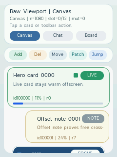
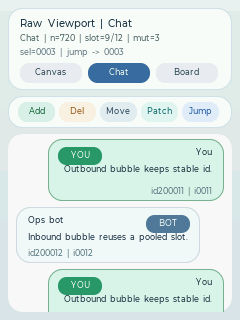
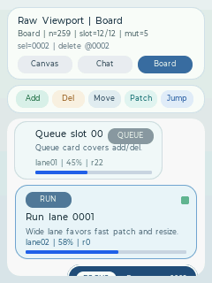
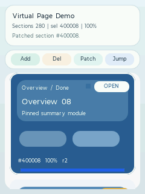
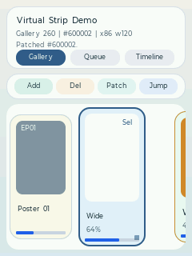
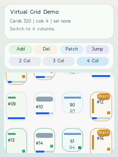
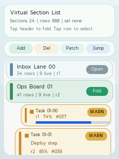
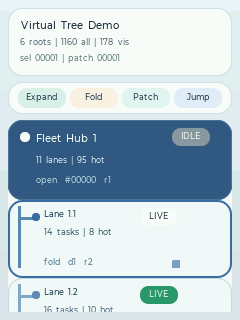

# 设计理念与选型

## 为什么需要 virtual 家族

在嵌入式 GUI 场景里，最常见的矛盾是：

- 数据量很大
- 屏幕很小
- 内存很紧
- 状态很多

业务上很容易出现几百到上千条数据，但同一时刻屏幕上可能只显示十几个业务单元。  
如果继续沿用“把所有子控件一次性创建出来”的传统做法，通常会遇到下面几类问题：

- view 树过大，布局和重绘成本显著上升
- 业务层自己维护可见区和回收逻辑，代码越来越复杂
- item 有选中态、展开态、编辑态、动画态时，状态恢复变得困难
- 数据发生插入、删除、移动后，索引不再稳定，命中和局部刷新容易出错

virtual 家族的目的，就是把这些问题沉到统一的虚拟化核心里解决。

它的核心目标不是“做一个更长的 list”，而是提供一套通用能力：

- 只为当前可见区和超扫区创建 view
- 用 `stable_id` 标识真实业务对象
- 通过 slot 池复用 view 实例
- 支持 `keepalive`
- 支持 `state cache`
- 支持精确通知和局部刷新
- 支持可变尺寸 item

## 整体架构

可以把这套体系理解为三层：

```text
业务数据层
  item / section / node / grouped entry / custom block
        |
        v
语义化容器层
  virtual_list / page / strip / grid / section_list / tree
  或 direct virtual_viewport
        |
        v
虚拟化核心层
  stable_id / measure / slot reuse / keepalive / state cache / notify
        |
        v
真实 view 实例层
  create / bind / unbind / destroy
```

这张图要强调两件事。

### 1. 虚拟化不等于必须频繁 `malloc/free`

框架要求的是“逻辑上的创建、绑定、解绑、销毁接口”，不强制你一定使用堆分配。  
你可以像当前示例一样：

- 用静态数组做对象池
- 按 `view_type` 分池
- 在 `create_view()` 里从池中取对象
- 在 `unbind_view()` 或 `destroy_view()` 后把对象放回池

因此 virtual 家族管理的是**生命周期语义与复用策略**，而不是强制某一种内存模型。

### 2. 高层容器的价值主要是“语义”和“易用性”

底层 `virtual_viewport` 已经能完成大部分虚拟化工作。  
高层容器的意义在于把一类常见业务语义包装成更顺手的接口：

- `virtual_page`：section / module
- `virtual_strip`：横向轨道 item
- `virtual_grid`：二维 tile
- `virtual_section_list`：组头 + 组内条目
- `virtual_tree`：可见节点流

因此，**选型时先看业务最小单元，不要先看界面长得像不像 list。**

## 先决定“最小业务单元”是什么

如果业务最小单元选错了，后面通常会有这些连锁问题：

- 语义不顺，helper 不顺手
- 业务层要自己补层级、分组或二维排布
- 插删改移通知很别扭
- 示例最后看起来都像 list，只是换了颜色

更合理的顺序是：

1. 先问：屏幕里最小业务单元是什么
2. 再问：它天然有没有横向、分组、层级、二维或 section 语义
3. 最后才决定视觉长什么样

例如：

- 最小单元是仪表盘模块：`virtual_page`
- 最小单元是横向轨道里的海报卡：`virtual_strip`
- 最小单元是二维墙上的 tile：`virtual_grid`
- 最小单元是树节点：`virtual_tree`

## `stable_id` 是第一公民

索引用来描述“当前顺序中的第几个”，`stable_id` 用来描述“这个业务对象是谁”。  
一旦发生插入、删除、移动，如果把索引当长期身份，就会遇到：

- 选中项错乱
- 命中测试映射错位
- `ensure_visible` 定位到错误对象
- 动画或编辑态恢复到错误对象

因此建议：

- 只要对象本体没变，`stable_id` 不要变
- 尽量实现 `find_index_by_stable_id`
- 尽量围绕 `stable_id` 使用定位和刷新 helper

典型 helper 包括：

- `find_*_by_stable_id`
- `resolve_*_by_stable_id`
- `find_view_by_stable_id`
- `scroll_to_*_by_stable_id`
- `ensure_*_visible_by_stable_id`
- `notify_*_changed_by_stable_id`
- `notify_*_resized_by_stable_id`

## 只创建可见 view，不等于状态一定会丢

最容易被担心的问题是：  
“如果 item 只有在需要渲染时才创建，那动画、选中态、展开态会不会因为回收而丢失？”

答案是：取决于状态放在哪一层，而不是取决于是否使用虚拟化。

这套架构提供了两种机制：

- `keepalive`
- `state cache`

### `keepalive`

适合这类情况：

- 当前 item 正在播放关键局部动画
- 当前 item 正处在复杂编辑态
- 当前 item 短时间内会继续交互，希望保住同一个 view 实例

它解决的是：“尽量保住这一个 view 对象本身。”

### `state cache`

适合这类情况：

- 展开/折叠状态
- 选中状态
- pulse 动画阶段
- 某个临时编辑值
- 某个局部滚动位置或高亮状态

它解决的是：“view 可以回收，但回来时状态能恢复。”

一个非常实用的分层原则是：

- 长期业务状态放数据模型
- 可恢复的临时 UI 状态放 `state cache`
- 极少数必须保留同一实例的状态才用 `keepalive`

可以记成一句话：

**长期靠模型，短期靠缓存，极少数必须保实例的才用 keepalive。**

## `view_type` 的职责是池化分类，不一定等于业务模板总数

在 raw `virtual_viewport` 里，`view_type` 的职责是：

- 告诉框架哪些 view 之间可以复用
- 帮助对象池分类

它并不一定需要和业务模板一一对应。  
如果切得太细，可能会带来：

- 池被切碎，复用率下降
- 切场景后拿不到合适的旧 view
- 业务层被迫维护很多细碎类型

更推荐的方式是：

- 在 adapter 层保留相对粗粒度的 `view_type`
- 在 `bind_view()` 阶段继续根据场景和状态做视觉细化

## 精确通知比“全部重刷”更重要

这套体系对通知粒度很敏感。简单记法如下：

| 数据变化 | 应使用的通知 |
| --- | --- |
| 整体重排、整体过滤、整体切场景 | `notify_data_changed()` |
| 单项内容变化，尺寸不变 | `notify_*_changed()` |
| 单项主轴尺寸变化 | `notify_*_resized()` |
| 插入 | `notify_*_inserted()` |
| 删除 | `notify_*_removed()` |
| 移动 | `notify_*_moved()` |

如果尺寸变化却只发了 `changed`，最常见的问题就是：

- 文本出框
- item 重叠
- 下一项位置不对
- 滚动锚点不稳

## 选型总表

| 容器 | 最小业务单元 | 结构特征 | 典型场景 |
| --- | --- | --- | --- |
| `virtual_viewport` | 完全自定义 | 自定义 | 画布块、聊天气泡、看板卡、自定义混排 |
| `virtual_list` | row | 单轴纵向 | feed、日志、普通消息列表 |
| `virtual_page` | section / module | 单轴纵向 | 仪表盘、设置页大区块、详情页模块 |
| `virtual_strip` | rail item | 单轴横向 | 海报带、播放队列、时间轴条带 |
| `virtual_grid` | tile / card | 二维网格 | 商品宫格、相册墙、卡片面板 |
| `virtual_section_list` | section header + item | 纵向分组 | 设置分组、工单分组、消息分组 |
| `virtual_tree` | node | 纵向层级 | 文件树、设备拓扑、组织树、任务树 |

## 视觉示例

### Raw `virtual_viewport`

#### Canvas 场景



#### Chat 场景



#### Board 场景



### `virtual_page`



### `virtual_strip`



### `virtual_grid`



### `virtual_section_list`



### `virtual_tree`



观察这些图时，重点不是配色，而是语义：

- `virtual_page` 先看到的是异构模块块
- `virtual_strip` 先看到的是横向节奏和不同宽度 item
- `virtual_grid` 先看到的是 tile 密度和列数切换
- `virtual_section_list` 先看到的是组头，再看到组内条目
- `virtual_tree` 先看到的是层级与连接关系

## 何时直接用 raw `virtual_viewport`

如果你的业务单元既不是 row，也不是 page / grid / section / tree，而只是想复用：

- 按需创建
- 可变尺寸
- `stable_id`
- slot 复用
- `keepalive`
- `state cache`

那么直接使用 raw `virtual_viewport` 会更合适。

典型情况：

- 画布块混排
- 自定义聊天单元
- 看板 lane 混排
- 一个容器里混合多种不适合命名成 list/page 的异构块

如果你发现某类自定义 viewport 场景已经稳定且重复出现，再考虑进一步抽象成新的高层 wrapper。
