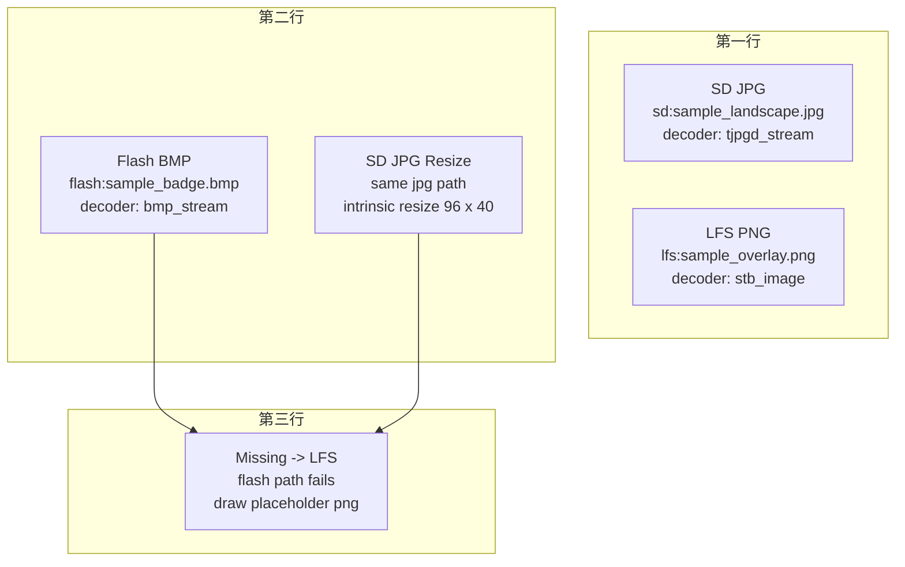
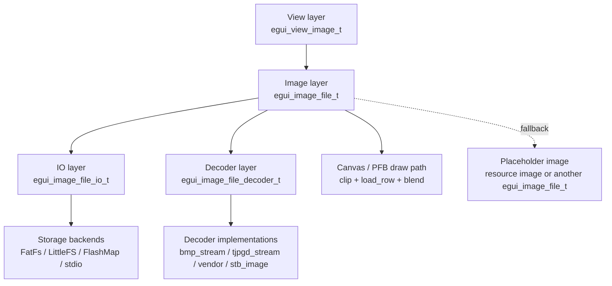
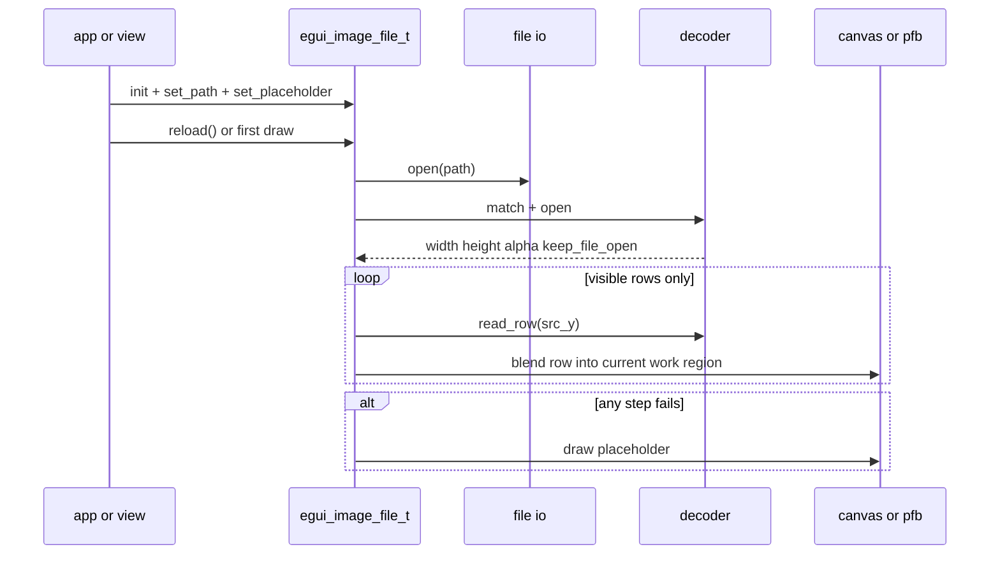
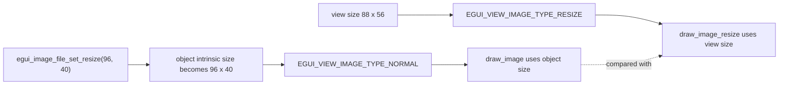
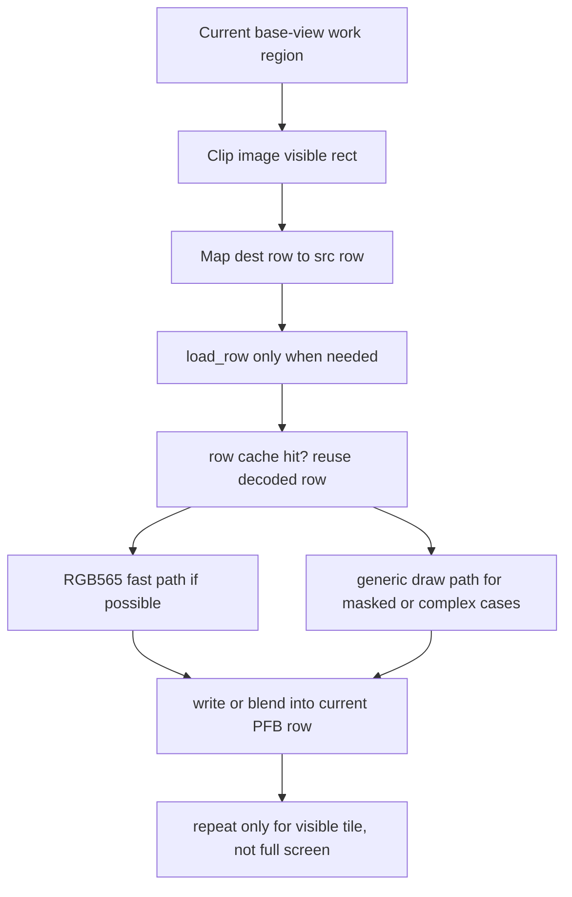

# file_image

`file_image` 例程演示运行时从外部文件路径加载图片并显示，覆盖 `jpg / png / bmp` 三种常见格式。相比普通内置资源图片，这个例程更重要的价值不只是“能显示文件图片”，而是把 `egui_image_file` 的整个分层思路跑通：

- 逻辑路径和具体存储后端解耦
- 文件 IO 和格式 decoder 解耦
- `egui_image_file_t` 和具体 view 解耦
- 渲染流程围绕 PFB（局部帧缓冲）做按行读取和按可见区绘制

如果你要把这套能力搬到量产 app，这个例程可以当成一份最小参考接线图。

## 快速总览



上图对应当前 demo 中的 5 张卡片：

- `sd:sample_landscape.jpg`
- `lfs:sample_overlay.png`
- `flash:sample_badge.bmp`
- 同一张 `sd:` JPG 的“对象内建缩放”显示
- 缺失 `flash:` 路径时，回退到 `lfs:` PNG 占位图

其中状态标签不是核心库自动绘制的，而是例程通过：

- `egui_image_file_get_status()`
- `egui_image_file_get_decoder_name()`
- `egui_image_file_status_to_string()`

把当前加载结果转成文本展示出来，方便确认运行路径。

## 1. `egui_image_file` 到底是什么

先厘清一个边界：`egui_image_file_t` 严格来说不是一个独立的 `view` 控件，而是一个 `egui_image_t` 的实现。

也就是说：

- 真正挂在界面树里的，仍然是 `egui_view_image_t`
- `egui_image_file_t` 只是这个 view 背后的“图片数据源”之一
- 任何能消费 `egui_image_t` 的地方，理论上都可以消费 `egui_image_file_t`

这也是为什么这个设计比“直接做一个文件图片控件”更灵活：view 负责布局、区域和失效；image object 负责取点、取尺寸、绘制和回退。

最小使用方式如下：

```c
static egui_image_file_t photo;
static egui_view_image_t image_view;

egui_image_file_init(&photo);
egui_image_file_set_path(&photo, "sd:album/cat.jpg");
egui_image_file_reload(&photo);

egui_view_image_init(EGUI_VIEW_OF(&image_view));
egui_view_image_set_image(EGUI_VIEW_OF(&image_view), (egui_image_t *)&photo);
```

## 2. 总体结构



可以把这套能力拆成 4 层来看：

| 层 | 代表对象 | 职责 | 放在哪里 |
| --- | --- | --- | --- |
| View 层 | `egui_view_image_t` | 管区域、布局、失效、触发 draw | `src/widget/` |
| Image 层 | `egui_image_file_t` | 懒打开、选 decoder、逐行缓存、fallback | `src/image/` |
| 接线层 | `egui_image_file_io_t`、`egui_image_file_decoder_t` | 文件系统适配、格式解码适配 | `example/` 或产品 app |
| 存储/解码实现层 | `FatFs`、`LittleFS`、`FlashMap`、`TJpgDec`、vendor JPEG/PNG | 真正读文件、真正解码 | 平台侧或 app 侧 |

这个边界是刻意设计的：

- `src/` 不固化具体文件系统实现
- `src/` 不固化具体图片格式库
- 产品侧可以按芯片能力自行替换 IO 和 decoder
- 同一套 UI 代码可以继续写逻辑路径，例如 `sd:boot/logo.bmp`

## 3. 工作机制



`egui_image_file_t` 的工作流程可以概括成“配置对象 -> 触发打开 -> 按行绘制 -> 失败回退”。

### 3.1 初始化阶段

初始化时只会建立对象本身，不会立刻打开文件：

```c
egui_image_file_init(&image);
egui_image_file_set_placeholder(&image, placeholder);
egui_image_file_set_path(&image, "flash:boot/logo.bmp");
```

这时 `status` 一般还是 `idle` 或 `no_path`，文件和 decoder 都还没建立运行态。

### 3.2 什么时候真正打开文件

有两类入口会触发真正打开：

- 主动调用 `egui_image_file_reload()`
- 首次调用 `get_size / get_point / draw_image / draw_image_resize`

这里采用懒打开而不是 `set_path()` 立即打开，有两个原因：

- 初始化阶段可以先把路径、IO、占位图等参数全部配好
- 很多图片对象可能只在部分页面出现，没有必要一上电就全部打开

### 3.3 decoder 选择规则

打开时会按注册顺序遍历 decoder：

1. `match(path)` 先看扩展名是否值得尝试
2. `open()` 尝试解析头部并返回宽高、alpha、是否保留文件句柄
3. 第一个 `open()` 成功的 decoder 获胜

所以 decoder 注册顺序非常关键，例程当前推荐顺序是：

`BMP stream -> vendor JPEG -> TJpgDec -> vendor PNG -> generic fallback`

PC 示例实际是：

`BMP stream -> TJpgDec -> stb_image`

### 3.4 运行态里缓存了什么

`egui_image_file_t` 不是只存一个 path，它还维护一组运行态信息：

- `path`：当前逻辑路径
- `io` / `active_io`：实例专属 IO 或当前生效 IO
- `decoder` / `decoder_ctx`：命中的 decoder 及其上下文
- `file_handle`：流式 decoder 可长期持有的文件句柄
- `width` / `height`：源图尺寸
- `row_pixels`：当前缓存的一行 RGB565 数据
- `row_alpha`：当前缓存的一行 alpha 数据，仅带透明度时分配
- `cached_row` / `row_cache_valid`：上一条已解码的源行索引

这意味着它既不是“完全无状态的路径包装”，也不是“整张图都解到 RAM 的大对象”，而是一个围绕逐行绘制构建的轻量运行态。

### 3.5 失败如何回退

如果以下任一步失败：

- 无路径
- 无默认 IO
- 文件打开失败
- 没有任何 decoder 命中
- decoder 打开失败
- 某一行读取失败

那么 draw 路径会尝试绘制 `placeholder`。如果没有设置占位图，就只是不画任何像素。

需要注意：占位图只是视觉兜底，不会吞掉真实状态。业务侧仍然可以通过 `get_status()` 看到原始失败原因。

### 3.6 状态码说明

| 状态 | 含义 | 常见原因 |
| --- | --- | --- |
| `idle` | 已初始化，但尚未成功打开 | 刚 `init`、刚 `set_path`、刚 `set_io` |
| `ready` | 已打开，当前 decoder 可工作 | `reload()` 成功，或首次 draw 成功 |
| `no_path` | 没有路径 | `set_path(NULL)` 或空字符串 |
| `no_io` | 没有可用 IO | 没设置实例 IO，也没设置默认 IO |
| `no_decoder` | 没有任何 decoder 愿意处理这条路径 | 扩展名不支持，或 decoder 未注册 |
| `open_file_fail` | 文件没打开 | 路径错误、存储未挂载、前缀路由错误 |
| `open_decoder_fail` | 有 decoder 命中，但打开头部失败 | 文件损坏、格式不完整、实现不支持该子格式 |
| `decode_row_fail` | 某一行读取失败 | 流式解码出错、底层 IO 读失败 |
| `oom` | 内存不足 | 路径拷贝失败，或行缓存申请失败 |

## 4. 缩放语义说明



这是 `file_image` 最容易混淆的一点。这里实际上有两套缩放语义：

### 4.1 对象内建缩放：`egui_image_file_set_resize()`

```c
egui_image_file_set_resize(&resize_image, 96, 40);
egui_view_image_set_image_type(EGUI_VIEW_OF(&view), EGUI_VIEW_IMAGE_TYPE_NORMAL);
```

这表示：

- `resize_image` 这个图片对象对外报告的“自身尺寸”变成 `96 x 40`
- `get_size()` 会优先返回这个尺寸
- 普通 `draw_image()` 也会按这个尺寸绘制

例程里的 `SD JPG Resize` 卡片就是这种用法。它仍然使用 `EGUI_VIEW_IMAGE_TYPE_NORMAL`，但是图片对象本身已经被声明为“天然就是 96 x 40”。

### 4.2 View 级缩放：`EGUI_VIEW_IMAGE_TYPE_RESIZE`

```c
egui_view_set_size(EGUI_VIEW_OF(&view), 88, 56);
egui_view_image_set_image_type(EGUI_VIEW_OF(&view), EGUI_VIEW_IMAGE_TYPE_RESIZE);
```

这表示：

- 不管图片对象自己的尺寸是多少
- 最终都按 view 的工作区尺寸来绘制

例程里的 `Missing -> LFS` 卡片就是这个思路。它让占位图跟随卡片图片区尺寸铺满，而不是维持占位图原始尺寸。

### 4.3 两者的优先级

优先级可以简单记成：

- `EGUI_VIEW_IMAGE_TYPE_NORMAL`：用图片对象自己的尺寸；如果对象设置过 `set_resize()`，就用缩放后的尺寸
- `EGUI_VIEW_IMAGE_TYPE_RESIZE`：用 view 尺寸；这时 view 的 `draw_image_resize(width, height)` 优先级更高

也就是说，`set_resize()` 更像是在改 `egui_image_file_t` 的“固有尺寸”，而 `EGUI_VIEW_IMAGE_TYPE_RESIZE` 是在改最终绘制框。

### 4.4 `set_resize()` 不是“强制省内存开关”

`egui_image_file_set_resize()` 会影响绘制尺寸和取点映射，但不等于一定减少 decoder 内部 RAM：

- 对流式 BMP：更小的目标尺寸通常意味着更少的目标像素处理，收益明显
- 对 `TJpgDec`：会减少实际命中的目标行数，但 band 工作缓冲仍然存在
- 对 `stb_image` 这种整图 fallback：原图仍然会先整图解码到 RAM，再按目标尺寸取行

所以它首先是“显示尺寸语义”，其次才可能带来部分绘制侧收益。

## 5. 针对 PFB 的设计优化



`egui_image_file` 的核心设计目标之一，就是适配 EmbeddedGUI 的局部帧缓冲模式，而不是默认存在一个全屏 framebuffer。

### 5.1 只画当前可见工作区

绘制前会先用当前画布工作区裁剪：

- 图片整体在屏幕外则直接返回
- 图片只和当前工作区局部相交时，只处理那一块

这一步对 PFB 很关键，因为当前工作区往往只是整屏中的一个小 tile。

### 5.2 按行读取，而不是整图展开

decoder 的核心接口不是“解整张图”，而是：

```c
int (*read_row)(void *decoder_ctx, uint16_t row, uint16_t *rgb565_row, uint8_t *alpha_row);
```

这使 `egui_image_file` 可以在绘制时：

- 需要哪一行，才读哪一行
- 当前 PFB 不覆盖的区域，不触发读取
- 行缓存大小只和图片宽度相关，而不是和整图像素数相关

### 5.3 宽度相关缓存走 heap，避免固定 RAM 占用

打开 decoder 后，`egui_image_file` 会按真实图片宽度动态申请：

- `row_pixels[width]`
- `row_alpha[width]`，仅当 decoder 声明有 alpha 时申请

这样做有两个意义：

- 不需要为“最大可能图片宽度”预留静态全局数组
- 同一个对象能适应不同尺寸文件，而不会把 RAM 永久锁死在固定上限上

这也符合本仓库的约束：尺寸相关 buffer 不应该用大静态数组顶替 heap。

### 5.4 行缓存命中可以避免重复解码

对象内部只缓存“上一条已经读过的源行”。

这看起来很小，但对 PFB 和缩放都很有价值：

- 普通绘制时，同一屏幕行只需解一次源行
- 缩放绘制时，多个目标行可能映射到同一个源行
- 只要映射结果没变，就不会重复调用 decoder

### 5.5 RGB565 下的直接写入快路径

当满足以下条件时，会尽量绕开逐点绘制，直接写当前 PFB：

- `EGUI_CONFIG_COLOR_DEPTH == 16`
- 已拿到当前 PFB 行指针
- 条件允许使用 fast path

普通未缩放路径下：

- 无 mask、无 alpha、画布 alpha 为 100% 时，可以直接 `memcpy`
- 无 mask、有全局 alpha 时，用 RGB565 快速混合
- 有 alpha 或有 mask 时，走按行 blend helper

### 5.6 缩放路径会复用 run，而不是逐像素硬算到底

缩放时用了两组整数映射 helper：

- `resize_axis_map()`：把目标坐标映射到源坐标
- `resize_axis_run_end()`：找出同一个源像素还能连续覆盖到目标坐标的哪里

这意味着：

- 同一个源像素对应的一段目标横向区域，可以一次性填满
- 同一个源行对应的一段目标纵向区域，也可以批量复用

当同时满足“无 mask、无 alpha、RGB565”时，缩放快路径甚至会把第一条已经混好的目标行直接 `memcpy` 到后续重复行，进一步减少 CPU 消耗。

### 5.7 什么时候会回到通用慢路径

以下情况会退回更保守的绘制方式：

- 颜色深度不是 RGB565
- 当前 canvas 带 mask
- 源图带 alpha，且缩放快路径不覆盖
- 无法直接拿到 PFB 行指针

这不是功能缺失，而是刻意把“最常见、最有收益”的路径优化掉，把复杂场景留给统一画布逻辑处理。

## 6. 接口说明

### 6.1 全局注册接口

| 接口 | 作用 | 说明 |
| --- | --- | --- |
| `egui_image_file_set_default_io()` | 设置默认 IO | 对没有实例专属 IO 的图片对象生效 |
| `egui_image_file_register_decoder()` | 注册一个 decoder | 按注册顺序参与匹配；重复注册同一指针是安全的 |
| `egui_image_file_clear_decoders()` | 清空 decoder 列表 | 适合 app 重新初始化前使用 |

### 6.2 `egui_image_file_io_t`

`egui_image_file_io_t` 定义了最小文件访问协议：

| 字段 | 必要性 | 用途 |
| --- | --- | --- |
| `open` | 必需 | 根据逻辑路径打开文件，返回句柄 |
| `read` | 几乎总是必需 | 读取字节流 |
| `seek` | 流式 decoder 常常必需 | 头部解析、按行读取、跳转带宽 |
| `tell` | 某些整图 decoder 需要 | 例如 `stb_image` 先获取文件总长度 |
| `close` | 必需 | 释放文件句柄 |
| `user_data` | 可选 | 挂底层文件系统上下文 |

对于简单单后端产品，`default_io` 就够了；对于多后端产品，推荐先用 `mount_router` 把多个 IO 合成一个总入口。

### 6.3 `egui_image_file_decoder_t`

decoder 接口分成 4 段：

| 字段 | 作用 | 说明 |
| --- | --- | --- |
| `name` | 调试名 | 例程把它显示在状态标签里 |
| `match(path)` | 预筛选 | 通常先按扩展名过滤 |
| `open()` | 打开并解析头部 | 返回尺寸、alpha、是否长期持有文件句柄 |
| `read_row()` | 读取某一行 | 输出 RGB565 行和可选 alpha 行 |
| `close()` | 释放 decoder 上下文 | 由运行态关闭时统一调用 |

`open()` 通过 `egui_image_file_open_result_t` 回传 4 个关键信息：

| 字段 | 含义 |
| --- | --- |
| `width` / `height` | 源图尺寸 |
| `has_alpha` | 是否需要 alpha 行缓存 |
| `keep_file_open` | decoder 是否依赖长期保留文件句柄 |

这里的 `keep_file_open` 是区分“流式 decoder”和“整图 decoder”的关键：

- `bmp_stream`、`tjpgd_stream` 设为 `1`，因为后续 `read_row()` 还要继续读文件
- `stb_image` 设为 `0`，因为它在 `open()` 阶段已经把整张图搬进内存

### 6.4 对象接口

| 接口 | 作用 | 备注 |
| --- | --- | --- |
| `egui_image_file_init()` | 初始化对象 | 绑定 `egui_image_api_t` 接口表 |
| `egui_image_file_deinit()` | 释放对象 | 会关 decoder、关文件、释放路径和行缓存 |
| `egui_image_file_set_path()` | 设置路径 | 会关闭旧运行态并重置为 `idle` |
| `egui_image_file_set_io()` | 设置实例专属 IO | 不设置时使用默认 IO |
| `egui_image_file_set_placeholder()` | 设置占位图 | 失败时用于 draw fallback |
| `egui_image_file_set_resize()` | 设置对象内建尺寸 | 影响 `get_size()` 和普通 `draw_image()` |
| `egui_image_file_clear_resize()` | 取消对象内建尺寸 | 恢复源图尺寸语义 |
| `egui_image_file_get_resize()` | 查询对象内建尺寸 | 只有启用时返回成功 |
| `egui_image_file_reload()` | 重新打开 | 适合路径、IO 或外部文件变化后重载 |
| `egui_image_file_get_status()` | 查询状态 | 业务可以决定怎么显示错误 |
| `egui_image_file_get_decoder_name()` | 查询当前 decoder 名 | 仅 `ready` 后通常有值 |
| `egui_image_file_status_to_string()` | 状态转字符串 | 方便日志或界面调试 |

### 6.5 与 `egui_view_image_t` 搭配时最常用的两个接口

| 接口 | 作用 |
| --- | --- |
| `egui_view_image_set_image()` | 把 `egui_image_file_t` 挂给 view |
| `egui_view_image_set_image_type()` | 决定是普通绘制还是按 view 尺寸缩放 |

## 7. 当前例程的接线方式

### 7.1 设计边界

当前例程把核心边界分得很清楚：

- 文件图片能力在 `src/` 只提供统一接口、文件 IO 协议、decoder 注册和绘制逻辑
- 具体解码器放在例程中，PC 示例里使用 `stb_image` 做通用 fallback
- JPG 额外提供了基于 `TJpgDec` 的流式 decoder 示例
- BMP 额外提供了一个流式 decoder 示例
- `vendor_jpeg_template/` 提供芯片厂商 JPEG / 硬件 JPEG 外设接入模板
- `vendor_png_template/` 提供芯片厂商 PNG 或第三方 PNG 库接入模板
- `fatfs_template/`、`littlefs_template/`、`flash_map_template/`、`mount_router_template/` 提供不同存储后端和多挂载路由模板

### 7.2 app 初始化 helper

`decoder_registry.c/.h` 把推荐注册顺序固化成一个 helper；`file_image_stack.c/.h` 再往上包一层，把下面几步收敛起来：

- `egui_image_file_set_default_io()`
- `file_image_mount_router_io_init()`
- `file_image_decoder_registry_apply()`

所以产品 app 如果不想手写初始化样板，可以直接用：

```c
static file_image_stack_state_t g_file_stack_state;

static const file_image_stack_config_t g_file_stack_cfg = {
	.default_io = NULL,
	.mount_entries = g_mounts,
	.mount_entry_count = sizeof(g_mounts) / sizeof(g_mounts[0]),
	.fallback_io = &g_lfs_io,
	.decoder_config = &g_decoder_cfg,
};

file_image_stack_apply(&g_file_stack_state, &g_file_stack_cfg);
```

注意：`file_image_stack_state_t` 必须是 `static` 或其他长生命周期对象，不能放在初始化函数临时栈上。

### 7.3 当前 PC 示例的逻辑路径

为了演示多挂载路由，PC 例程把：

- `sd:`
- `lfs:`
- `flash:`

三个逻辑前缀都路由到了各自的 `stdio` IO，但最终共同指向同一个 `files/` 目录。这样做只是为了演示接线方式；迁到 MCU 时，只需要把这些后端替换成真实的 `FatFs`、`LittleFS` 或 Flash 地址表实现。

### 7.4 当前 PC 示例的 decoder 顺序

PC 默认 decoder 注册顺序为：

`BMP stream -> TJpgDec -> stb_image`

因此：

- 常规 BMP 优先走流式路径
- 常规 JPG 优先走 `TJpgDec`
- PNG 和不被前两者支持的情况回退到 `stb_image`

MCU 推荐顺序则是：

`BMP stream -> vendor JPEG -> TJpgDec -> vendor PNG -> stb_image`

## 8. 与 LVGL 的做法对比

LVGL 也采用“文件系统接入”和“图片解码”分层的思路：

- 文件路径先经过 `lv_fs_drv`
- 再交给 image decoder
- decoder 一般拆成 `info / open / get_area / close`

本仓库和 LVGL 的思路相似，但取舍略有不同：

- 相同点：都把“路径访问”和“格式解码”拆开，便于平台替换
- 不同点：本仓库不把 BMP/JPG/PNG 的具体 decoder 固化到 `src/`
- 本仓库更强调 app 侧自由组合，让同一核心接口适配不同芯片能力

从资源受限角度看，当前设计更偏向：

- `src/` 保持稳定、轻量、可复用
- `example/` 或产品侧决定是否使用低 RAM 流式 decoder
- 高 RAM fallback 只在合适的平台上启用

## 9. 使用建议和常见坑

### 9.1 什么时候应该主动调用 `reload()`

如果你希望在第一帧渲染前就知道加载是否成功，最好在初始化阶段主动调用一次 `egui_image_file_reload()`。这样：

- 错误能更早暴露
- 界面可以提前准备状态提示文案
- 首帧 draw 时不会把“打开文件 + 选 decoder”的成本也叠上去

### 9.2 placeholder 可以继续是文件图片对象

占位图不要求一定是内置资源图，它也可以是另一个 `egui_image_file_t`。例程里就是把缺失路径回退到另一个 `png_image`。核心里也专门避免了“placeholder 指向自己”导致递归回退的问题。

### 9.3 不要把通用大 fallback 带到低 RAM 量产版本

`stb_image` 这类整图解码方案对 PC 很方便，但量产 MCU 上要谨慎：

- 大图会先完整解到 RAM
- PNG/JPG 峰值内存更难控
- 即使最终只画一个 PFB tile，也不代表 decoder 自身就低 RAM

### 9.4 decoder 顺序不要写反

如果把高优先级的低 RAM decoder 放到通用 fallback 后面，那么前者可能永远命不中，最终把所有图片都交给整图 decoder，RAM 行为会和预期完全不同。

### 9.5 业务层优先写逻辑路径，不要写物理路径

推荐：

- `sd:photo/cat.jpg`
- `lfs:icon/battery.png`
- `flash:boot/logo.bmp`

不推荐把底层物理路径、盘符、Flash 偏移直接散在 UI 代码里。这样换存储拓扑时，只需要改接线层，不需要改页面逻辑。

## 10. 迁移到产品 app 时建议优先阅读

- `integration_guide.md`：把 `FatFs / LittleFS / FlashMap / mount_router / decoder_registry` 串成完整 MCU 接线流程
- `decoder_registry.c/.h`：推荐 decoder 顺序的最小 helper
- `file_image_stack.c/.h`：把默认 IO、路由 IO、decoder 注册打包成一次初始化
- `fatfs_template/`、`littlefs_template/`、`flash_map_template/`、`mount_router_template/`：按你的存储后端直接抄模板
- `vendor_jpeg_template/`、`vendor_png_template/`：需要接硬件 JPEG 或芯片厂商 PNG 时再加

如果你后续需要更低 RAM 的 JPG/PNG 方案，也可以继续沿着这套接口把 decoder 做成更强的按块/按行模式，而不需要修改 `src/image/egui_image_file.*` 的核心接口。
